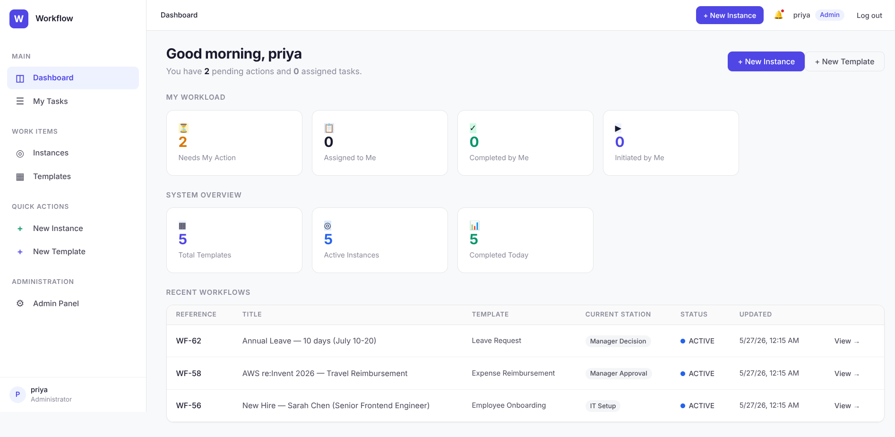
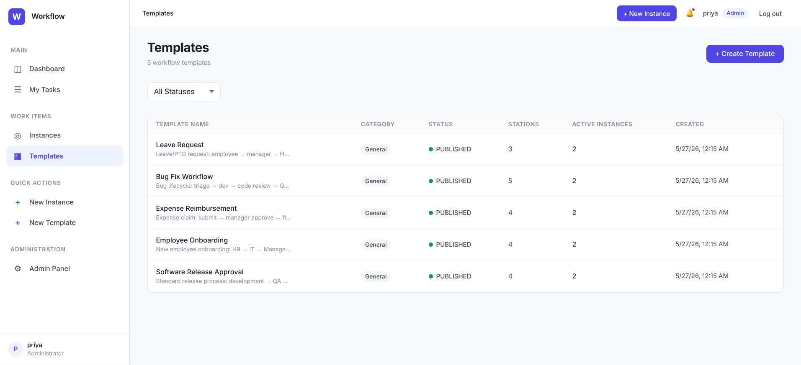
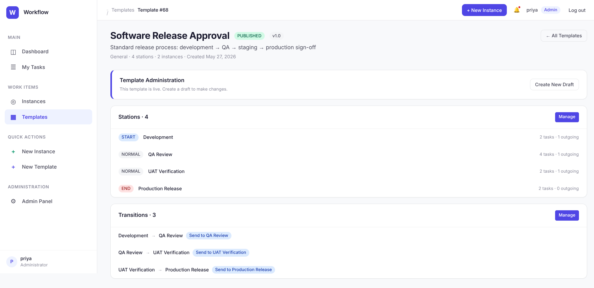
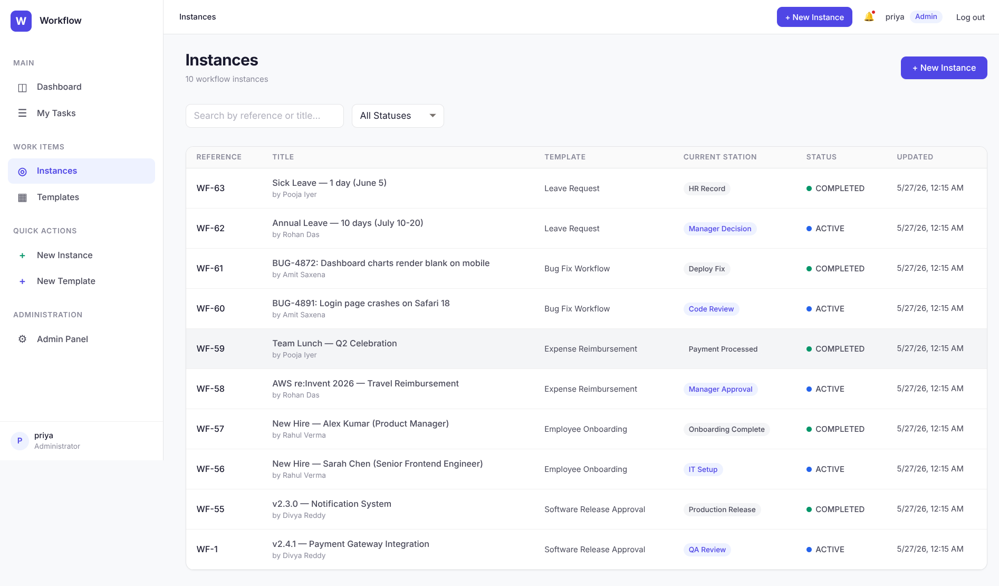
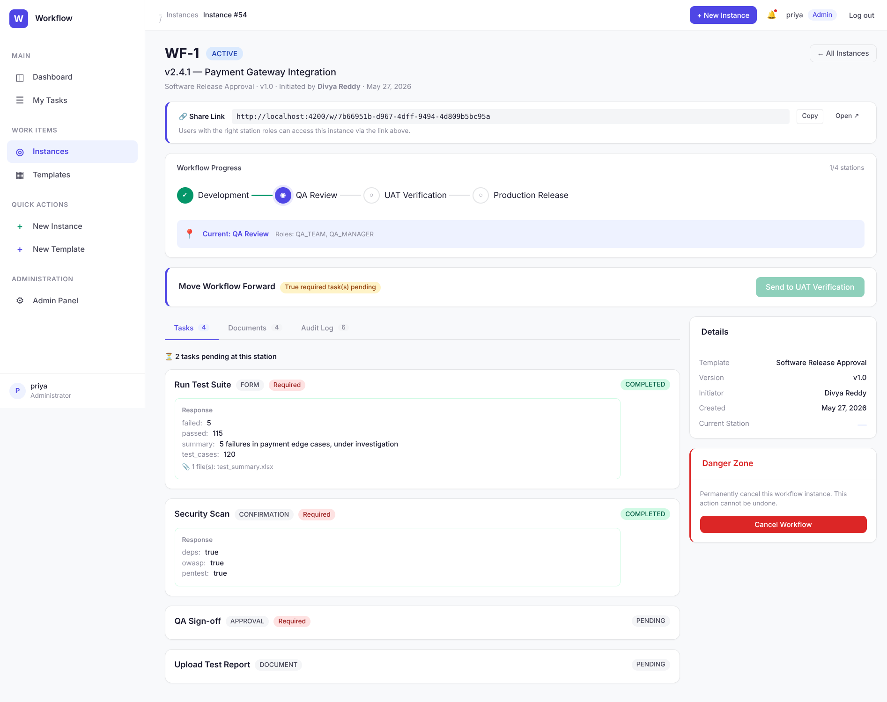
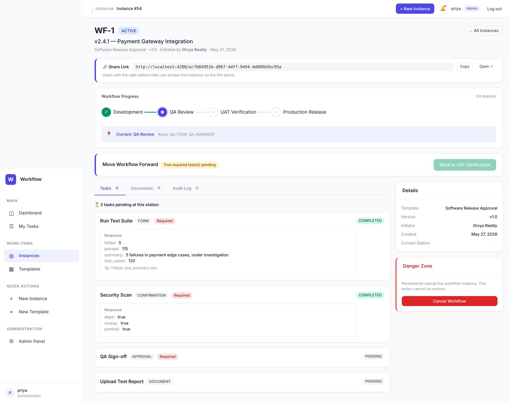
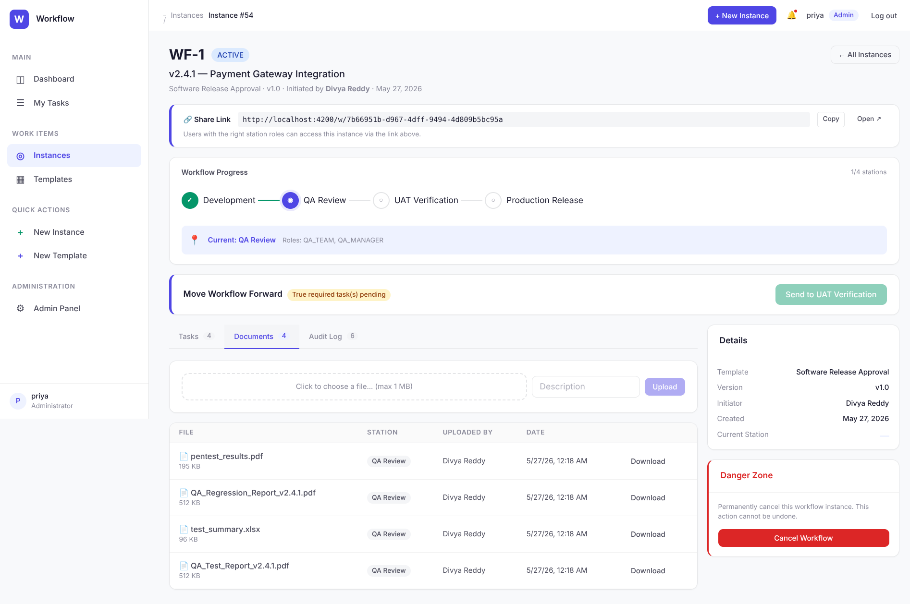
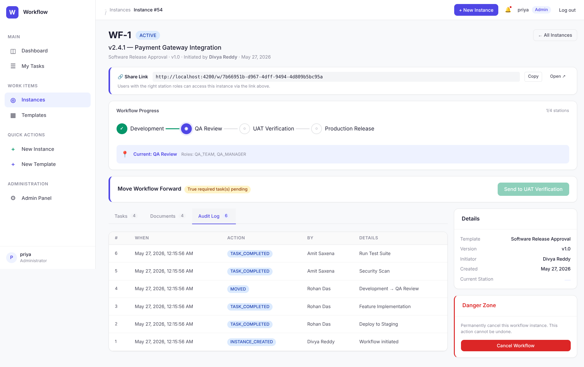
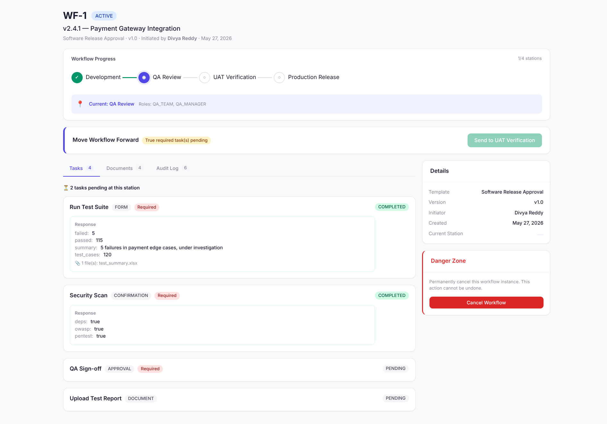
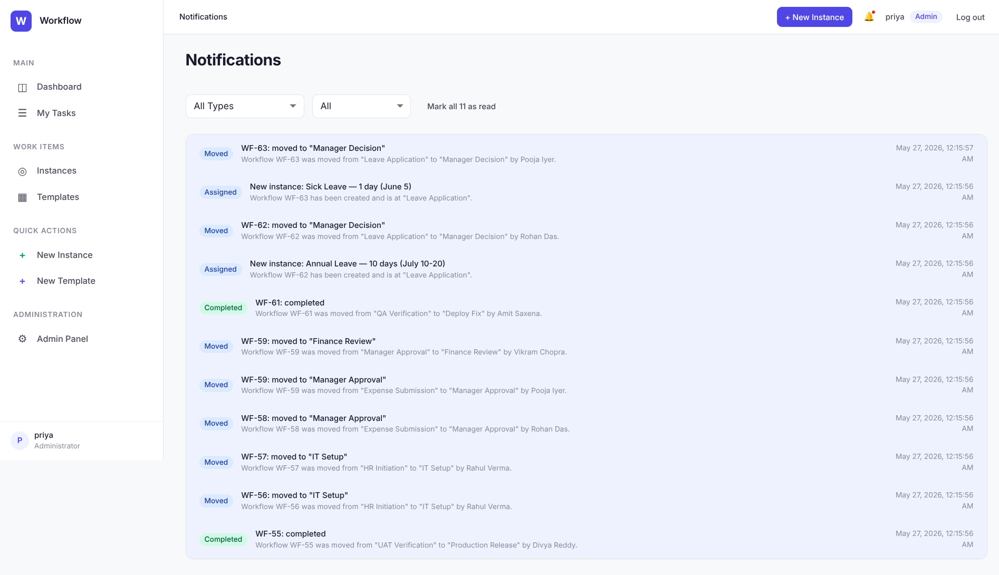

# 🎬 Demo SOP — Enterprise Workflow Management System

> **Standard Operating Procedure for a complete end-to-end demo**
> Time: ~15 minutes | Roles: Admin → PM → Developer → QA Lead → Finance

---

## 📋 Table of Contents

1. [Prerequisites & Launch](#1-prerequisites--launch)
2. [Architecture Overview](#2-architecture-overview)
3. [Login & Role Switching](#3-login--role-switching)
4. [Dashboard Walkthrough](#4-dashboard-walkthrough)
5. [Template Deep-Dive](#5-template-deep-dive)
6. [Instance Lifecycle Demo](#6-instance-lifecycle-demo)
7. [Task Execution](#7-task-execution)
8. [Workflow Movement](#8-workflow-movement)
9. [Documents & Audit Trail](#9-documents--audit-trail)
10. [Public Instance Sharing](#10-public-instance-sharing)
11. [Notifications](#11-notifications)
12. [Role-Based Access Demo](#12-role-based-access-demo)
13. [Appendix: API Reference](#13-appendix-api-reference)

---

## 1. Prerequisites & Launch

### Requirements

| Tool | Version |
|------|---------|
| Docker + Docker Compose | Latest |
| Free Ports | 4200, 8000, 8080, 5432 |
| Memory | ≥ 8 GB recommended |

### 🚀 Launch (One Command)

```bash
git clone https://github.com/shreyashsharmaprojects-del/workflow-management-system.git
cd workflow-management-system/workflow_platform
sudo docker-compose up -d --build
```

Wait ~60 seconds for all 4 services to become healthy. Verify:

```bash
sudo docker-compose ps
# All 4 services should show "healthy" or "Up"
```

### 🌐 Service URLs

| Service | URL | Purpose |
|---------|-----|---------|
| **Angular App** | http://localhost:4200 | Main UI |
| **Django REST API** | http://localhost:8000/api/v1/ | Backend APIs |
| **API Docs (Swagger)** | http://localhost:8000/api/v1/docs/ | Interactive API docs |
| **Keycloak Admin** | http://localhost:8080 | Auth server |
| **Django Admin** | http://localhost:8000/control-panel/ | Model admin |

### 🔑 Keycloak Admin Login

| Field | Value |
|-------|-------|
| URL | http://localhost:8080 |
| Username | `admin` |
| Password | `admin` |
| Realm | `master` |

---

## 2. Architecture Overview

```
┌──────────────────┐     ┌──────────────────┐     ┌──────────────────┐
│   Angular 17      │────▶│  Django 4.2 + DRF │────▶│  PostgreSQL 16    │
│   Port 4200       │     │  Port 8000        │     │  Port 5432        │
│   Keycloak-angular │     │  40+ REST APIs    │     │  11 Models        │
└────────┬─────────┘     └────────┬─────────┘     └──────────────────┘
         │                        │
         └────────────┬───────────┘
                      ▼
              ┌──────────────────┐
              │  Keycloak 25      │
              │  Port 8080        │
              │  JWT RS256        │
              │  9 Realm Roles    │
              │  24 Demo Users    │
              └──────────────────┘
```

### Key Design Principles

- **Immutable Audit** — Every action logged, history is append-only
- **RBAC at Station Level** — Who can act at each workflow stage
- **Template Versioning** — Publish frozen versions; drafts stay editable
- **Optimistic Locking** — Prevents concurrent workflow conflicts
- **5-Step Engine Validation** — Active status → Permission → Valid transition → Tasks complete → Atomic save

---

## 3. Login & Role Switching

### Demo Users

> **All passwords:** `Workflow@123`

| User | Display Name | Key Roles | Use For |
|------|-------------|-----------|---------|
| `priya` | Priya Sharma | ADMIN | Admin view, templates, dashboard |
| `admin.rahul` | Rahul Verma | ADMIN, DEV_TEAM, FINANCE_TEAM, HR_TEAM | Full power user |
| `pm.divya` | Divya Reddy | PM_TEAM | Initiate instances from templates |
| `vikram` | Vikram Singh | DEV_TEAM | Developer tasks |
| `dev.rohan` | Rohan Das | DEV_TEAM | Developer tasks |
| `qa.amit` | Amit Saxena | QA_TEAM | QA tasks & verification |
| `qa.lead.kavya` | Kavya Rao | QA_MANAGER | QA sign-off |
| `pm.head.vikram` | Vikram Chopra | PM_MANAGER, HR_TEAM | Manager approvals |
| `neha` | Neha Desai | AUDITOR | Read-only audit access |

> 📋 [Full 24-user list →](SEED_USERS.md)

### Switching Users in Demo

1. Click the user avatar in the bottom-left sidebar
2. Click **Logout**
3. Login as a different user
4. **Pro Tip:** Open an incognito window for each role to avoid re-login

---

## 4. Dashboard Walkthrough

> **Login as:** `priya` / `Workflow@123`

Navigate to http://localhost:4200 — you'll see:

| Element | What It Shows |
|---------|--------------|
| **Sidebar** | Navigation: Dashboard, Templates, Instances, Notifications |
| **Stats Cards** | Total instances, active, completed, cancelled |
| **Quick Actions** | New Instance, New Template buttons |
| **Recent Activity** | Latest instance updates across all workflows |
| **Header** | Breadcrumb, notifications bell (with unread count), user avatar |

### Things to Point Out

- The notification bell shows real-time unread count
- Stats cards are interactive — click to filter instances
- Sidebar highlights your current section
- The UI adapts from desktop to tablet widths



---

## 5. Template Deep-Dive



### 5 Demo Templates (Pre-loaded)

| # | Template Name | Stations | Tasks | Use Case |
|---|--------------|----------|-------|----------|
| 1 | **Software Release Approval** | 4 | 9 | Dev → QA → UAT → Production |
| 2 | **Employee Onboarding** | 4 | 6 | HR → IT → Manager → Complete |
| 3 | **Expense Reimbursement** | 4 | 7 | Submit → Manager → Finance → Paid |
| 4 | **Bug Fix Workflow** | 5 | 9 | Triage → Dev → Review → QA → Deploy |
| 5 | **Leave Request** | 3 | 4 | Apply → Manager → HR Record |

### Walkthrough: Software Release Template

1. Click **Templates** in sidebar
2. Click **"Software Release Approval"**
3. Observe:
   - **4 Stations:** Development (START) → QA Review → UAT Verification → Production Release (END)
   - **9 Tasks** across stations with FORM, APPROVAL, CONFIRMATION, DOCUMENT types
   - Each station shows assigned **roles** (DEV_TEAM, QA_TEAM, PM_TEAM, ADMIN)
   - Tasks marked **Required** must be completed before moving to next station
   - Stations have **order** showing the flow sequence



### Task Types Explained

| Type | Icon | How It Works |
|------|------|-------------|
| **FORM** | 📝 | Dynamic fields builder — text, number, select, date, textarea |
| **APPROVAL** | ✅ | Choose from configurable options (e.g., Approve/Reject) |
| **CONFIRMATION** | ☑️ | Checklist with required/optional items |
| **DOCUMENT** | 📎 | File upload with type and size restrictions |

---

## 6. Instance Lifecycle Demo

> **Login as:** `pm.divya` (Product Manager)



### Creating an Instance

1. Click **Instances** → **New Instance**
2. Select **"Expense Reimbursement"** template (v1.0)
3. Fill in title: `"EXP-2026-05 — Conference Travel Reimbursement"`
4. Click **Create**
5. You're taken to the instance detail page

### Instance Detail Page Tour

| Section | Description |
|---------|-------------|
| **Header** | Reference (WF-XX), status badge, template name, initiator, date |
| **Share Link** | Public token URL for external sharing |
| **Progress Tracker** | Visual station flow with ✓ Completed / ◉ Current / ○ Pending |
| **Action Bar** | "Move Workflow Forward" with available transitions |
| **Tasks Tab** | All tasks at current station with status |
| **Documents Tab** | All uploaded documents across stations |
| **Audit Log Tab** | Complete history of every action |
| **Details Sidebar** | Template, version, initiator, dates |
| **Danger Zone** | Cancel workflow (irreversible) |

---

## 7. Task Execution

> **Stay logged in as:** `pm.divya` (or switch to a role that can execute at current station)

### Execute a FORM Task

1. On the instance page, find a **PENDING** task
2. Click **Start →** (or the task card)
3. A modal opens with the dynamic form fields
4. Fill in all required fields:
   - Amount: `1250.00`
   - Category: `Travel`
   - Description: `Flight and hotel for DevConf 2026`
   - Date: `2026-05-15`
5. Click **Submit**
6. Task status changes from **PENDING** → **COMPLETED**
7. Response data appears inline on the task card

### Execute a CONFIRMATION Task

1. Click on a CONFIRMATION task
2. Check all required checkboxes
3. Optionally add remarks: `"All checks verified"`
4. Submit — status updates to COMPLETED

### Execute a DOCUMENT Task

1. Click on a DOCUMENT task
2. Use the file upload zone (drag & drop or click)
3. File restrictions enforced: type (PDF, PNG), size (1 MB)
4. Upload — file appears in the Documents tab

### Execute an APPROVAL Task

1. Click on an APPROVAL task
2. Select from the dropdown: `"Approved"` / `"Rejected"`
3. Submit — decision recorded in task response



---

## 8. Workflow Movement

### Moving to Next Station

1. Ensure all **Required** tasks at current station are COMPLETED
2. The **"Move Workflow Forward"** bar shows available transitions
3. If tasks are incomplete, it shows: `"X required task(s) pending"`
4. Click a transition button (e.g., **"Send to Finance Review"**)
5. Workflow moves to the next station
6. Progress tracker updates — current dot moves
7. New tasks appear for the new station's roles

### Full Expense Reimbursement Flow

| Step | Actor | Station | Actions |
|------|-------|---------|---------|
| 1 | `pm.divya` | Expense Submission | Submit expense form + attach receipt |
| 2 | `pm.head.vikram` | Manager Approval | Review & Approve |
| 3 | `admin.rahul` | Finance Review | Verify receipts, approve payment |
| 4 | System | Payment Processed | Final confirmation → **COMPLETED** |

### Blocked Scenarios

- **Missing tasks:** Can't move until required tasks done
- **Wrong role:** User without station role sees "You don't have permission"
- **Concurrent moves:** Optimistic locking prevents double-move

---

## 9. Documents & Audit Trail

### Documents Tab

1. On any instance, click the **Documents** tab
2. See all uploaded files across all stations
3. Files show: filename, uploaded by, station, timestamp
4. Download works with auth token (secure, not direct link)

### Audit Log Tab

1. Click the **Audit Log** tab
2. Every action is recorded:

| Event Type | Example |
|-----------|---------|
| `INSTANCE_CREATED` | Instance created by Divya Reddy |
| `TASK_SUBMITTED` | Task "Expense Details" submitted by Divya Reddy |
| `STATION_ENTERED` | Entered "Manager Approval" station |
| `DOCUMENT_UPLOADED` | "receipt.pdf" uploaded by Amit Saxena |
| `INSTANCE_CANCELLED` | Instance cancelled by Rahul Verma |

3. Each entry shows: timestamp, user, event type, description
4. **Immutable** — no edits or deletes possible



---

## 10. Public Instance Sharing

### Share a Live Instance

1. On any instance detail page, find the **"🔗 Share Link"** bar
2. Click **Copy** to copy the public URL
3. Open in an incognito window (no login required!)
4. The public view shows:
   - Instance reference, title, status
   - Progress tracker with current station
   - All tasks with responses (read-only)
   - Station role information
   - No admin controls, no cancel button

### Public URLs

- Format: `http://localhost:4200/w/<uuid-token>`
- Each instance gets a unique, unguessable UUID token
- Only shows data — no actions can be performed
- Perfect for sharing status with external stakeholders



---

## 11. Notifications

### In-App Notification Bell

1. Look at the header — the 🔔 bell icon shows unread count
2. Click the bell to open the notification popover
3. Recent notifications with type badges: Assigned, Moved, Completed
4. Click **"View All"** to open the full notifications page

### Notification Types

| Type | Triggered When |
|------|---------------|
| **Assigned** | You're assigned task(s) at a station |
| **Moved** | Workflow moves to a station you have access to |
| **Completed** | A task you were assigned to is completed |

### Email Notifications (Optional)

> Requires SMTP configuration in `.env`. Currently uses console backend by default.



---

## 12. Role-Based Access Demo

### Scenario: Unauthorized Access

1. Login as `vikram` (DEV_TEAM)
2. Navigate to an instance that's at **Finance Review** station
3. Notice:
   - ❌ Cannot see tasks (only FINANCE_TEAM can)
   - ❌ **"Move Workflow Forward"** is disabled
   - ℹ️ Message: "You don't have permission at this station"
   - ✅ Can still view progress, documents, and audit logs

### Scenario: Auditor View

1. Login as `neha` (AUDITOR)
2. Browse instances, templates, dashboards
3. Notice:
   - ✅ Can view everything (read-only)
   - ❌ Cannot execute tasks
   - ❌ Cannot move workflows
   - ❌ Cannot create instances or templates

### Scenario: Admin Full Access

1. Login as `priya` (ADMIN)
2. Full CRUD on templates (including creating new stations/tasks)
3. Can execute any task at any station
4. Can view all instances across all users
5. Can cancel any active workflow

---

## 13. Appendix: API Reference

### Base URL: `http://localhost:8000/api/v1/`

### Authentication

```bash
# Get JWT token
curl -X POST http://localhost:8080/realms/workflow-realm/protocol/openid-connect/token \
  -H "Content-Type: application/x-www-form-urlencoded" \
  -d "client_id=workflow-platform" \
  -d "username=priya" \
  -d "password=Workflow@123" \
  -d "grant_type=password"

# Use token in requests
curl http://localhost:8000/api/v1/instances/ \
  -H "Authorization: Bearer <token>"
```

### Key Endpoints

| Method | Endpoint | Description |
|--------|----------|-------------|
| GET | `/instances/` | List all instances (paginated) |
| GET | `/instances/{id}/` | Instance detail |
| POST | `/instances/` | Create new instance |
| GET | `/instances/{id}/tasks/` | Get tasks for current station |
| POST | `/instances/{id}/tasks/{task_id}/submit/` | Submit task response |
| POST | `/instances/{id}/move/` | Move workflow to next station |
| GET | `/instances/{id}/history/` | Audit log entries |
| GET | `/instances/{id}/documents/` | Instance documents |
| POST | `/instances/{id}/documents/upload/` | Upload document |
| GET | `/templates/` | List workflow templates |
| GET | `/templates/{id}/` | Template with stations & tasks |
| GET | `/dashboard/stats/` | Dashboard statistics |
| GET | `/notifications/` | User notifications |

### Interactive API Docs

Open http://localhost:8000/api/v1/docs/ for Swagger UI with:
- All endpoints documented
- Request/response schemas
- Try-it-out functionality (paste JWT token to test)

---

## 🎯 Demo Script (15-Minute Flow)

### Minute 0–2: Launch & Login
- Show docker-compose up
- Login as `priya`
- Point out dashboard stats, sidebar, notification bell

### Minute 2–4: Templates
- Navigate to Templates
- Open "Software Release Approval"
- Walk through 4 stations, 9 tasks, role assignments
- Show the visual station flow

### Minute 4–7: Instance & Tasks
- Login as `pm.divya`
- Create a new "Expense Reimbursement" instance
- Execute the FORM task (Expense Details)
- Upload a receipt (DOCUMENT task)
- Show task status changing from PENDING → COMPLETED

### Minute 7–9: Workflow Movement
- Move to "Manager Approval" station
- Login as `pm.head.vikram`
- See new APPROVAL task appear
- Approve and move to Finance Review

### Minute 9–11: Documents & Audit
- Show Documents tab with uploaded receipt
- Show Audit Log tab with full history
- Point out immutability

### Minute 11–13: Public Sharing
- Copy the share link
- Open in incognito window
- Show the clean public view

### Minute 13–15: RBAC & Wrap-up
- Login as `neha` (auditor) — show read-only
- Login as `vikram` (dev) — show "no permission" at Finance station
- Wrap up with summary of what was demoed

---

## 🧹 Cleanup

```bash
# Stop all services
sudo docker-compose down

# Stop and remove volumes (fresh start)
sudo docker-compose down -v

# Rebuild from scratch
sudo docker-compose up -d --build
```

---

## 📸 Screenshots

All screenshots are in `docs/screenshots/`:

| # | File | Screen |
|---|------|--------|
| 1 | `01-dashboard.png` | Dashboard with stats, sidebar, header |
| 2 | `02-templates-list.png` | 5 templates with descriptions |
| 3 | `03-template-detail.png` | Stations, tasks, roles, transitions |
| 4 | `04-instances-list.png` | All instances with status badges |
| 5 | `05-instance-detail.png` | Progress tracker, tasks, move bar |
| 6 | `06-documents-tab.png` | Uploaded files with download |
| 7 | `07-audit-log.png` | Immutable history entries |
| 8 | `08-task-modal.png` | Task execution form |
| 9 | `09-public-view.png` | Standalone view at /w/:token |
| 10 | `10-notifications.png` | Notifications page with filters |

---

> **Built with:** Angular 17 · Django 4.2 · Keycloak 25 · PostgreSQL 16 · Docker
> **License:** MIT
