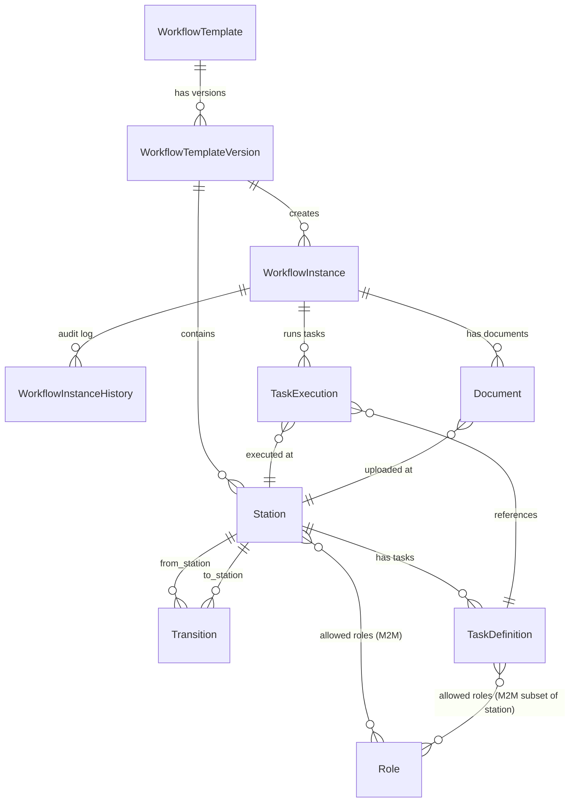

# ORM Design — Django Models
# Enterprise Workflow Management System

---

## Entity-Relationship Overview



---

# 1. Core Template Models

## 1.1 WorkflowTemplate

The master template definition. Editable while draft, **immutable after publish**.

```python
class WorkflowTemplate(models.Model):
    """
    Master workflow template. Editable while status=DRAFT.
    Once published, becomes immutable — any new edit creates a new version.
    """
    name = models.CharField(max_length=255)
    description = models.TextField(blank=True)
    category = models.CharField(max_length=100, blank=True)

    # Status: DRAFT (editable) → PUBLISHED (immutable)
    status = models.CharField(
        max_length=20,
        choices=[('DRAFT', 'Draft'), ('PUBLISHED', 'Published'), ('ARCHIVED', 'Archived')],
        default='DRAFT'
    )

    # The currently published version (NULL if never published)
    current_version = models.ForeignKey(
        'WorkflowTemplateVersion',
        on_delete=models.SET_NULL,
        null=True, blank=True,
        related_name='currently_for_template'
    )

    created_by = models.ForeignKey('auth.User', on_delete=models.PROTECT, related_name='templates_created')
    created_at = models.DateTimeField(auto_now_add=True)
    updated_at = models.DateTimeField(auto_now=True)

    class Meta:
        ordering = ['-created_at']

    def __str__(self):
        return f"{self.name} ({self.status})"
```

**Key Design Decisions:**
- `current_version` is a denormalized pointer to the latest published version (for fast lookup)
- Template itself stores only metadata. All structural data lives in `WorkflowTemplateVersion`
- Once `status=PUBLISHED`, the template fields (name, description) can still be edited, but the associated `WorkflowTemplateVersion` is frozen

---

## 1.2 WorkflowTemplateVersion

A **frozen snapshot** of the template structure at publish time. Immutable.

```python
class WorkflowTemplateVersion(models.Model):
    """
    Immutable snapshot of a template at a point in time.
    Created when admin clicks "Publish".
    All stations, transitions, and tasks are snapshotted under this version.
    """
    template = models.ForeignKey(
        WorkflowTemplate,
        on_delete=models.CASCADE,
        related_name='versions'
    )
    version_number = models.PositiveIntegerField()  # 1, 2, 3...
    version_label = models.CharField(max_length=50)  # "v1.0", "v2.0"

    # Publishing metadata
    published_by = models.ForeignKey('auth.User', on_delete=models.PROTECT)
    published_at = models.DateTimeField(auto_now_add=True)
    change_notes = models.TextField(blank=True)

    # The next draft (if this version is being edited into a new version)
    # NULL for the latest published version if no draft exists
    next_draft = models.ForeignKey(
        'self',
        on_delete=models.SET_NULL,
        null=True, blank=True,
        related_name='previous_version'
    )

    class Meta:
        unique_together = [('template', 'version_number')]
        ordering = ['-version_number']

    def __str__(self):
        return f"{self.template.name} v{self.version_number}"
```

**How Versioning Works:**
1. Template starts as DRAFT → user edits stations/transitions/tasks freely
2. User clicks **Publish** → system deep-copies all stations, transitions, tasks into a new `WorkflowTemplateVersion` record
3. This version is now immutable — no edits allowed to its stations/transitions/tasks
4. If user wants to edit, they click **Create New Draft** → system clones the latest version into a new draft, user edits, publishes as next version

---

## 1.3 Station

A workflow stage/state. Belongs to a **template version** (not directly to template).

```python
class Station(models.Model):
    """
    A workflow stage within a template version.
    """
    class StationType(models.TextChoices):
        START = 'START', 'Start'
        NORMAL = 'NORMAL', 'Normal'
        END = 'END', 'End'

    template_version = models.ForeignKey(
        WorkflowTemplateVersion,
        on_delete=models.CASCADE,
        related_name='stations'
    )

    name = models.CharField(max_length=255)
    description = models.TextField(blank=True)
    station_type = models.CharField(
        max_length=10,
        choices=StationType.choices,
        default=StationType.NORMAL
    )

    # Order within the template (for display)
    order = models.PositiveIntegerField(default=0)

    # Roles allowed to act on this station
    allowed_roles = models.ManyToManyField(
        'Role',
        blank=True,
        related_name='accessible_stations'
    )

    # JSON-based dynamic configuration (Phase 2)
    # Example: {"auto_move": true, "sla_hours": 48, "custom_field": "value"}
    configuration = models.JSONField(default=dict, blank=True)

    # Auto-move: if true, workflow auto-transitions when all tasks complete
    auto_move = models.BooleanField(default=False)

    created_at = models.DateTimeField(auto_now_add=True)

    class Meta:
        ordering = ['template_version', 'order']
        unique_together = [('template_version', 'name')]

    def __str__(self):
        return f"{self.name} ({self.station_type})"

    @property
    def is_start(self):
        return self.station_type == self.StationType.START

    @property
    def is_end(self):
        return self.station_type == self.StationType.END
```

**Rules:**
- Exactly **one** START station per template version
- At least **one** END station per template version
- Multiple NORMAL stations allowed
- When instance reaches END station → workflow completes, no further movement

---

## 1.4 Transition

Defines allowed directional movement between two stations.

```python
class Transition(models.Model):
    """
    Directional edge: from_station → to_station.
    Must exist for a workflow to move between stations.
    """
    template_version = models.ForeignKey(
        WorkflowTemplateVersion,
        on_delete=models.CASCADE,
        related_name='transitions'
    )

    from_station = models.ForeignKey(
        Station,
        on_delete=models.CASCADE,
        related_name='outgoing_transitions'
    )
    to_station = models.ForeignKey(
        Station,
        on_delete=models.CASCADE,
        related_name='incoming_transitions'
    )

    # Label shown on the move button (e.g., "Approve", "Reject", "Send Back")
    label = models.CharField(max_length=100, blank=True)

    # Whether this transition requires remarks
    remarks_required = models.BooleanField(default=False)

    created_at = models.DateTimeField(auto_now_add=True)

    class Meta:
        unique_together = [('template_version', 'from_station', 'to_station')]
        ordering = ['from_station__order']

    def __str__(self):
        label_str = f" ({self.label})" if self.label else ""
        return f"{self.from_station.name} → {self.to_station.name}{label_str}"
```

**Key Rule:** Bidirectional movement requires **two** Transition records:
```
Development → QA Testing (label: "Send to QA")
QA Testing → Development (label: "Reject back")
```

---

# 2. Roles & RBAC

## 2.1 Role

```python
class Role(models.Model):
    """
    A role that can be assigned to stations and users.
    Mapped from Keycloak realm roles.
    Examples: QA_TEAM, DEV_TEAM, PM_MANAGER, DEV_OPS
    """
    name = models.CharField(max_length=100, unique=True)   # e.g., "QA_TEAM"
    display_name = models.CharField(max_length=255)         # e.g., "QA Team"
    description = models.TextField(blank=True)

    # The Keycloak role name for JWT mapping
    keycloak_role = models.CharField(max_length=255, blank=True)

    created_at = models.DateTimeField(auto_now_add=True)

    def __str__(self):
        return self.display_name
```

**How RBAC Works:**
1. Keycloak issues JWT with `realm_access.roles: ["QA_TEAM", "QA_MANAGER"]`
2. Django decodes JWT, extracts roles
3. When user tries to move workflow at Station X, engine checks: `user.roles ∩ station.allowed_roles ≠ ∅`
4. When user tries to execute a Task at Station X, engine checks:
   - If task has `allowed_roles` set: `user.roles ∩ task.allowed_roles ≠ ∅`
   - If task has NO `allowed_roles`: inherits station's roles (backward compatible)
5. No direct user-to-station mapping — everything goes through roles

---

# 3. Instance Models

## 3.1 WorkflowInstance

A running workflow execution created from a template version.

```python
class WorkflowInstance(models.Model):
    """
    A running instance of a workflow template.
    References a specific template version (frozen at creation time).
    """
    class InstanceStatus(models.TextChoices):
        ACTIVE = 'ACTIVE', 'Active'
        COMPLETED = 'COMPLETED', 'Completed'
        CANCELLED = 'CANCELLED', 'Cancelled'
        BLOCKED = 'BLOCKED', 'Blocked'

    # Reference to the template version this instance was created from
    template_version = models.ForeignKey(
        WorkflowTemplateVersion,
        on_delete=models.PROTECT,  # Cannot delete version if instances exist
        related_name='instances'
    )

    # Auto-generated unique reference: "WF-1042"
    reference = models.CharField(max_length=50, unique=True)

    # Human-readable title
    title = models.CharField(max_length=255)

    status = models.CharField(
        max_length=20,
        choices=InstanceStatus.choices,
        default=InstanceStatus.ACTIVE
    )

    # Current station
    current_station = models.ForeignKey(
        Station,
        on_delete=models.PROTECT,
        related_name='active_instances'
    )

    # Arbitrary key-value data attached at creation
    # e.g., {"project": "Auth Module", "priority": "High", "sprint": "Sprint 5"}
    instance_data = models.JSONField(default=dict, blank=True)

    # Concurrency control — optimistic locking
    version = models.PositiveIntegerField(default=1)

    # Who created the instance (BA/PM / Initiator)
    initiated_by = models.ForeignKey(
        'auth.User',
        on_delete=models.PROTECT,
        related_name='initiated_instances'
    )

    # Current owner (the user who last moved it here, for quick display)
    current_owner = models.ForeignKey(
        'auth.User',
        on_delete=models.SET_NULL,
        null=True, blank=True,
        related_name='owned_instances'
    )

    created_at = models.DateTimeField(auto_now_add=True)
    updated_at = models.DateTimeField(auto_now=True)
    completed_at = models.DateTimeField(null=True, blank=True)

    class Meta:
        ordering = ['-created_at']
        indexes = [
            models.Index(fields=['status']),
            models.Index(fields=['current_station']),
            models.Index(fields=['reference']),
        ]

    def __str__(self):
        return f"{self.reference}: {self.title}"

    @property
    def is_active(self):
        return self.status == self.InstanceStatus.ACTIVE

    @property
    def is_completed(self):
        return self.status == self.InstanceStatus.COMPLETED
```

**Concurrency:**
- `version` field enables optimistic locking
- Before any state mutation, engine reads `version`, then updates with `WHERE version = <read_value>`
- If another request changed it first → `version` mismatch → 409 Conflict → retry

---

## 3.2 WorkflowInstanceHistory

**Immutable, append-only audit log.** Every action on an instance creates one row.

```python
class WorkflowInstanceHistory(models.Model):
    """
    Append-only audit log. NEVER updated or deleted after creation.
    """
    class ActionType(models.TextChoices):
        INSTANCE_CREATED = 'INSTANCE_CREATED', 'Instance Created'
        MOVED = 'MOVED', 'Moved'
        TASK_STARTED = 'TASK_STARTED', 'Task Started'
        TASK_COMPLETED = 'TASK_COMPLETED', 'Task Completed'
        TASK_FAILED = 'TASK_FAILED', 'Task Failed'
        DOCUMENT_UPLOADED = 'DOCUMENT_UPLOADED', 'Document Uploaded'
        REMARKS_ADDED = 'REMARKS_ADDED', 'Remarks Added'
        INSTANCE_CANCELLED = 'INSTANCE_CANCELLED', 'Instance Cancelled'
        INSTANCE_COMPLETED = 'INSTANCE_COMPLETED', 'Instance Completed'

    instance = models.ForeignKey(
        WorkflowInstance,
        on_delete=models.CASCADE,
        related_name='history'
    )

    action = models.CharField(max_length=30, choices=ActionType.choices)
    action_by = models.ForeignKey('auth.User', on_delete=models.PROTECT)

    # For MOVED actions
    from_station = models.ForeignKey(
        Station, on_delete=models.PROTECT,
        null=True, blank=True,
        related_name='history_from'
    )
    to_station = models.ForeignKey(
        Station, on_delete=models.PROTECT,
        null=True, blank=True,
        related_name='history_to'
    )

    # For TASK_* actions
    task_definition = models.ForeignKey(
        'TaskDefinition', on_delete=models.PROTECT,
        null=True, blank=True
    )
    task_execution = models.ForeignKey(
        'TaskExecution', on_delete=models.SET_NULL,
        null=True, blank=True
    )

    # User-provided remarks
    remarks = models.TextField(blank=True)

    # Arbitrary metadata (e.g., task form data snapshot, document names)
    metadata = models.JSONField(default=dict, blank=True)

    timestamp = models.DateTimeField(auto_now_add=True, db_index=True)

    class Meta:
        ordering = ['-timestamp']
        verbose_name_plural = 'Workflow Instance Histories'
        indexes = [
            models.Index(fields=['instance', '-timestamp']),
            models.Index(fields=['action']),
        ]
        # PROTECT against any accidental update/delete at DB level
        # Application layer must also enforce append-only

    def __str__(self):
        return f"{self.instance.reference}: {self.get_action_display()} @ {self.timestamp}"

    def save(self, *args, **kwargs):
        """
        Enforce append-only: once created, cannot be updated.
        This is the application-level guard. DB-level triggers can also be used.
        """
        if self.pk is not None:
            raise ValueError("WorkflowInstanceHistory is append-only. Cannot update existing entries.")
        super().save(*args, **kwargs)
```

---

# 4. Task Models

## 4.1 TaskDefinition

A task configured on a station. The **template-level definition** (what should be done).

```python
class TaskDefinition(models.Model):
    """
    Template-level task configuration.
    Defines WHAT task should be done at a station.
    Instances create TaskExecution records when tasks are actually run.
    """
    class TaskType(models.TextChoices):
        APPROVAL = 'APPROVAL', 'Approval'
        FORM = 'FORM', 'Form'
        DOCUMENT = 'DOCUMENT', 'Document Upload'
        CONFIRMATION = 'CONFIRMATION', 'Confirmation Checklist'
        PAYMENT = 'PAYMENT', 'Payment'
        API = 'API', 'API Call'
        EMAIL = 'EMAIL', 'Email Notification'

    station = models.ForeignKey(
        Station,
        on_delete=models.CASCADE,
        related_name='task_definitions'
    )

    name = models.CharField(max_length=255)
    description = models.TextField(blank=True)
    task_type = models.CharField(max_length=20, choices=TaskType.choices)

    # Is this task required before the workflow can move?
    is_required = models.BooleanField(default=True)

    # Display order within the station
    order = models.PositiveIntegerField(default=0)

    # Roles allowed to execute this task (subset of station.allowed_roles)
    # If empty, inherits station's allowed_roles — any station actor can execute
    allowed_roles = models.ManyToManyField(
        'Role',
        blank=True,
        related_name='executable_tasks',
        help_text='Subset of station roles. If blank, any station role can execute.'
    )

    # ============================================================
    # JSON CONFIGURATION — drives dynamic form rendering
    # ============================================================

    # For FORM type: defines input fields
    # {
    #   "fields": [
    #     {"key": "test_cases", "label": "Test Cases", "type": "number", "required": true},
    #     {"key": "summary", "label": "Summary", "type": "textarea", "required": true},
    #     {"key": "env", "label": "Environment", "type": "select", "options": ["Dev","Staging","Prod"]}
    #   ]
    # }
    #
    # For CONFIRMATION type: defines checklist items
    # {
    #   "checklist": [
    #     {"key": "unit_tests_passed", "label": "All unit tests passing", "required": true},
    #     {"key": "security_scan_done", "label": "Security scan completed", "required": true}
    #   ]
    # }
    #
    # For DOCUMENT type: defines constraints
    # {
    #   "allowed_types": [".pdf", ".png", ".jpg"],
    #   "max_file_size_mb": 10,
    #   "min_files": 2,
    #   "max_files": 5
    # }
    #
    # For APPROVAL type: defines options
    # {
    #   "options": ["Approved", "Rejected", "Needs More Work"],
    #   "remarks_required": true
    # }
    #
    # For API type: defines endpoint
    # {
    #   "url": "https://api.example.com/webhook",
    #   "method": "POST",
    #   "headers": {"Authorization": "Bearer {{token}}"},
    #   "payload_template": {"workflow_id": "{{instance_id}}"}
    # }
    #
    # For EMAIL type: defines template
    # {
    #   "to": ["{{station_owner_email}}"],
    #   "subject": "Action Required: {{instance_title}}",
    #   "template": "email/workflow_notification.html"
    # }
    task_config = models.JSONField(default=dict, blank=True)

    created_at = models.DateTimeField(auto_now_add=True)

    class Meta:
        ordering = ['station', 'order']
        unique_together = [('station', 'name')]

    def __str__(self):
        return f"{self.name} ({self.task_type}) @ {self.station.name}"
```

---

## 4.2 TaskExecution

The **runtime execution** of a task within a workflow instance.

```python
class TaskExecution(models.Model):
    """
    Runtime record of a task being executed within a workflow instance.
    Created when a user starts executing a task at their station.
    """
    class ExecutionStatus(models.TextChoices):
        PENDING = 'PENDING', 'Pending'
        IN_PROGRESS = 'IN_PROGRESS', 'In Progress'
        COMPLETED = 'COMPLETED', 'Completed'
        FAILED = 'FAILED', 'Failed'
        SKIPPED = 'SKIPPED', 'Skipped'

    instance = models.ForeignKey(
        WorkflowInstance,
        on_delete=models.CASCADE,
        related_name='task_executions'
    )

    task_definition = models.ForeignKey(
        TaskDefinition,
        on_delete=models.PROTECT,
        related_name='executions'
    )

    station = models.ForeignKey(
        Station,
        on_delete=models.PROTECT,
        related_name='task_executions'
    )

    status = models.CharField(
        max_length=20,
        choices=ExecutionStatus.choices,
        default=ExecutionStatus.PENDING
    )

    # ============================================================
    # EXECUTION DATA — stores the user's actual input/response
    # ============================================================

    # For FORM type: stores filled-in form data as key-value
    # {
    #   "test_cases": 45,
    #   "summary": "3 failures in edge cases",
    #   "env": "Staging"
    # }
    #
    # For CONFIRMATION type: stores tick state
    # {
    #   "unit_tests_passed": true,
    #   "security_scan_done": false,
    #   "db_migrations_ready": true
    # }
    #
    # For APPROVAL type: stores decision
    # {
    #   "decision": "Approved",
    #   "remarks": "QA signed off"
    # }
    response_data = models.JSONField(default=dict, blank=True)

    # Who executed it
    executed_by = models.ForeignKey(
        'auth.User',
        on_delete=models.PROTECT,
        null=True, blank=True,
        related_name='task_executions'
    )

    remarks = models.TextField(blank=True)

    # Timestamps
    created_at = models.DateTimeField(auto_now_add=True)
    started_at = models.DateTimeField(null=True, blank=True)
    completed_at = models.DateTimeField(null=True, blank=True)
    failed_at = models.DateTimeField(null=True, blank=True)

    # Concurrency control
    version = models.PositiveIntegerField(default=1)

    class Meta:
        ordering = ['-created_at']
        # A task definition can be executed multiple times in the same instance
        # (e.g., if workflow moves back and re-enters the station)
        unique_together = [('instance', 'task_definition', 'created_at')]

    def __str__(self):
        return f"{self.task_definition.name} — {self.status}"

    @property
    def is_required(self):
        return self.task_definition.is_required

    @property
    def is_completed(self):
        return self.status == self.ExecutionStatus.COMPLETED
```

**Important:** A `TaskDefinition` can have **multiple** `TaskExecution` records in the same instance — this happens when a workflow moves backward and re-enters a station (e.g., QA rejects → back to Development → back to QA = new QA task executions).

---

# 5. Document Model

## 5.1 Document

Files uploaded during workflow execution. Part of the **Document Trail**.

```python
def document_upload_path(instance, filename):
    """
    Store files as: workflows/{instance_ref}/{station_name}/{timestamp}_{filename}
    """
    import time
    ts = int(time.time())
    safe_name = filename.replace(' ', '_')
    return (
        f"workflows/{instance.instance.reference}/"
        f"{instance.station.name}/{ts}_{safe_name}"
    )


class Document(models.Model):
    """
    A file uploaded during workflow execution.
    Attached to a specific instance + station.
    Part of the Document Trail (see 4.1 in UX design).
    """
    instance = models.ForeignKey(
        WorkflowInstance,
        on_delete=models.CASCADE,
        related_name='documents'
    )

    station = models.ForeignKey(
        Station,
        on_delete=models.PROTECT,
        related_name='documents'
    )

    # Optionally linked to a specific task execution
    task_execution = models.ForeignKey(
        TaskExecution,
        on_delete=models.SET_NULL,
        null=True, blank=True,
        related_name='documents'
    )

    file = models.FileField(upload_to=document_upload_path)
    original_filename = models.CharField(max_length=500)
    file_size = models.PositiveBigIntegerField()  # bytes
    content_type = models.CharField(max_length=100)

    # Who uploaded it
    uploaded_by = models.ForeignKey(
        'auth.User',
        on_delete=models.PROTECT,
        related_name='uploaded_documents'
    )

    # Optional description/tags for searchability
    description = models.CharField(max_length=500, blank=True)
    tags = models.JSONField(default=list, blank=True)  # ["screenshot", "test-evidence"]

    uploaded_at = models.DateTimeField(auto_now_add=True)

    class Meta:
        ordering = ['-uploaded_at']
        indexes = [
            models.Index(fields=['instance', '-uploaded_at']),
            models.Index(fields=['station']),
        ]

    def __str__(self):
        return self.original_filename

    def delete(self, *args, **kwargs):
        """
        Documents should NOT be deletable (immutable trail).
        At most, soft-delete or mark as superseded.
        """
        raise ValueError("Documents cannot be deleted. They are part of the immutable trail.")
```

---

# 6. Notification Models (Phase 2)

```python
class Notification(models.Model):
    """
    Email notification record.
    """
    class NotificationType(models.TextChoices):
        WORKFLOW_MOVED = 'WORKFLOW_MOVED', 'Workflow Moved'
        TASK_ASSIGNED = 'TASK_ASSIGNED', 'Task Assigned'
        TASK_COMPLETED = 'TASK_COMPLETED', 'Task Completed'
        INSTANCE_COMPLETED = 'INSTANCE_COMPLETED', 'Instance Completed'
        INSTANCE_BLOCKED = 'INSTANCE_BLOCKED', 'Instance Blocked'

    instance = models.ForeignKey(
        WorkflowInstance,
        on_delete=models.CASCADE,
        related_name='notifications'
    )

    notification_type = models.CharField(max_length=30, choices=NotificationType.choices)

    # Recipients
    recipient = models.ForeignKey('auth.User', on_delete=models.CASCADE)
    recipient_email = models.EmailField()
    cc_emails = models.JSONField(default=list, blank=True)

    # Content
    subject = models.CharField(max_length=500)
    body_html = models.TextField()

    # Status
    sent = models.BooleanField(default=False)
    sent_at = models.DateTimeField(null=True, blank=True)
    error_message = models.TextField(blank=True)

    created_at = models.DateTimeField(auto_now_add=True)

    class Meta:
        ordering = ['-created_at']

    def __str__(self):
        return f"{self.notification_type} → {self.recipient_email}"
```

---

# 7. Complete Model Relationships (Django View)

```
WorkflowTemplate
    ├── versions (WorkflowTemplateVersion) ─── 1:N
    │       ├── stations (Station) ─── 1:N
    │       │       ├── allowed_roles (Role) ─── M:N
    │       │       ├── task_definitions (TaskDefinition) ─── 1:N
    │       │       ├── outgoing_transitions (Transition) ─── 1:N
    │       │       └── incoming_transitions (Transition) ─── 1:N
    │       ├── transitions (Transition) ─── 1:N
    │       └── instances (WorkflowInstance) ─── 1:N
    │               ├── history (WorkflowInstanceHistory) ─── 1:N (append-only)
    │               ├── task_executions (TaskExecution) ─── 1:N
    │               │       └── documents (Document) ─── 1:N
    │               ├── documents (Document) ─── 1:N
    │               └── notifications (Notification) ─── 1:N

Role
    └── accessible_stations (Station) ─── M:N
```

---

# 8. Database-Level Rules (Summary)

| # | Rule | Implementation |
|---|------|----------------|
| 1 | Templates immutable after publish | App-layer: `WorkflowTemplateVersion` is frozen on publish. `TaskDefinition`, `Station`, `Transition` have `on_delete=PROTECT` |
| 2 | History is append-only | `WorkflowInstanceHistory.save()` raises error if `pk` exists. DB trigger as extra guard |
| 3 | Documents are append-only | `Document.delete()` raises error. Files stored but not deletable |
| 4 | Instances reference template version | `WorkflowInstance.template_version` FK to `WorkflowTemplateVersion` with `PROTECT` |
| 5 | Transitions are directional | `Transition.from_station` and `Transition.to_station` — two rows needed for bidirectional |
| 6 | Optimistic locking | `version` field on `WorkflowInstance` and `TaskExecution` |
| 7 | Only START station can begin workflow | App-layer validation in engine |
| 8 | END station terminates workflow | App-layer: set `status=COMPLETED`, `completed_at=now()`, no further moves |
| 9 | Required tasks must complete | Engine checks `TaskExecution.is_completed` for all `is_required=True` tasks before allowing move |
| 10 | Station ownership via roles | Engine checks `user.roles ∩ station.allowed_roles ≠ ∅` |

---

# 9. Indexing Strategy

```sql
-- Fast lookup: find all instances at a station (dashboard queries)
CREATE INDEX idx_instance_station_status ON workflow_instance(current_station_id, status);

-- Fast lookup: find all history for an instance in time order
CREATE INDEX idx_history_instance_time ON workflow_instance_history(instance_id, timestamp DESC);

-- Fast lookup: find all documents for an instance
CREATE INDEX idx_document_instance_time ON document(instance_id, uploaded_at DESC);

-- Fast lookup: find all task executions for an instance
CREATE INDEX idx_task_exec_instance ON task_execution(instance_id, station_id, status);

-- Fast lookup: find all PENDING tasks at a station
CREATE INDEX idx_task_exec_station_status ON task_execution(station_id, status);
```

---

# 10. Summary: Model Count

| # | Model | Purpose | Mutability |
|---|-------|---------|------------|
| 1 | `WorkflowTemplate` | Template metadata | Fields editable; structure goes into version |
| 2 | `WorkflowTemplateVersion` | Frozen snapshot of template structure | **Immutable** after creation |
| 3 | `Station` | Workflow stage within a version | **Immutable** (belongs to version) |
| 4 | `Transition` | Directional edge between stations | **Immutable** (belongs to version) |
| 5 | `TaskDefinition` | Task config with JSON schema | **Immutable** (belongs to version) |
| 6 | `Role` | RBAC role (from Keycloak) | Mutable |
| 7 | `WorkflowInstance` | Running workflow | Mutable (state changes) |
| 8 | `WorkflowInstanceHistory` | Audit log entry | **Append-only, immutable** |
| 9 | `TaskExecution` | Runtime task execution | Mutable (status changes) |
| 10 | `Document` | Uploaded file | **Append-only, immutable** |
| 11 | `Notification` | Email notification record | Mutable (sent flag) |

**Total: 11 models**
