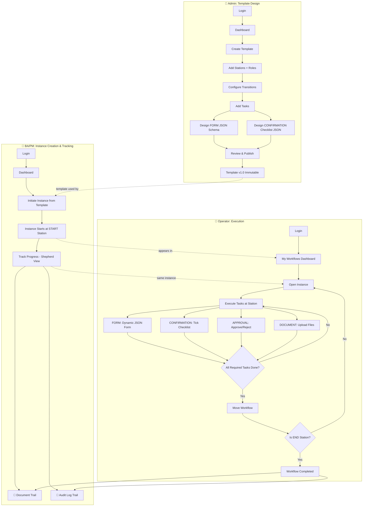

# UX Flow & Screen Design
# Enterprise Workflow Management System

---

## Personas

| Persona | Role | Goals |
|---------|------|-------|
| **Admin (Priya)** | Workflow Designer / System Admin | Create & publish workflow templates, configure stations, assign roles, design dynamic task forms |
| **Initiator (Arjun)** | Business Analyst / Product Manager | Create workflow instances from templates, shepherd them through all approval stages, ensure all tasks complete, track document trail |
| **Operator (Raj)** | QA Team Member / Developer | View assigned workflows, execute tasks at their station, upload documents, move workflows forward/backward |
| **Manager (Amit)** | QA Manager / Team Lead | Same as Operator + approve/reject transitions, review work |
| **Viewer (Neha)** | Auditor / Stakeholder | View workflow status, document trail, & full audit history; no action permissions |

---

# SCENARIO 1: Admin Creates an "SDLC Workflow" Template

## Screen 1.1 — Admin Login

```
┌──────────────────────────────────────────────────────────┐
│                                                          │
│              Enterprise Workflow Platform                │
│                                                          │
│           ┌─────────────────────────────────┐            │
│           │                                 │            │
│           │      Sign in with Keycloak      │            │
│           │                                 │            │
│           │   Username: [_______________]   │            │
│           │   Password: [_______________]   │            │
│           │                                 │            │
│           │   [      Sign In      ]         │            │
│           │                                 │            │
│           └─────────────────────────────────┘            │
│                                                          │
└──────────────────────────────────────────────────────────┘
```

After login, Priya lands on the Admin Dashboard.

---

## Screen 1.2 — Admin Dashboard

```
┌──────────────────────────────────────────────────────────┐
│  🏠 Dashboard  │  Templates  │  Instances  │  👤 Priya   │
├──────────────────────────────────────────────────────────┤
│                                                          │
│  ┌──────────┐  ┌──────────┐  ┌──────────┐  ┌──────────┐ │
│  │   12     │  │   145    │  │   38     │  │ 1,204    │ │
│  │Templates │  │  Active  │  │Completed │  │  Total   │ │
│  │          │  │Instances │  │ Today    │  │Instances │ │
│  └──────────┘  └──────────┘  └──────────┘  └──────────┘ │
│                                                          │
│  ── Quick Actions ──────────────────────────────────     │
│                                                          │
│  [+ Create New Template]                                 │
│                                                          │
│  ── Recent Templates ───────────────────────────────     │
│                                                          │
│  ┌──────────────────────────────────────────────────┐    │
│  │ SDLC Workflow          v3  │  Published  │  ...  │    │
│  │ Insurance Claim        v1  │  Draft      │  ...  │    │
│  │ Purchase Approval      v2  │  Published  │  ...  │    │
│  └──────────────────────────────────────────────────┘    │
│                                                          │
└──────────────────────────────────────────────────────────┘
```

Priya clicks **[+ Create New Template]**.

---

## Screen 1.3 — Create Template: Basic Info

```
┌──────────────────────────────────────────────────────────┐
│  🏠 Dashboard  >  Templates  >  Create New               │
├──────────────────────────────────────────────────────────┤
│                                                          │
│  Step 1 of 5: Template Information                       │
│  ═══════════════════════════                            │
│                                                          │
│  Template Name:     [ SDLC Workflow         ]            │
│                                                          │
│  Description:                                            │
│  ┌──────────────────────────────────────────────────┐    │
│  │ Standard Software Development Life Cycle         │    │
│  │ workflow for project tracking                    │    │
│  └──────────────────────────────────────────────────┘    │
│                                                          │
│  Category:          [ Software Development  ▾ ]          │
│                                                          │
│  Tags:              [sdlc] [dev] [qa] [+Add]             │
│                                                          │
│                                [Cancel]  [Next: Stations] │
│                                                          │
└──────────────────────────────────────────────────────────┘
```

Priya fills in details and clicks **[Next: Stations]**.

---

## Screen 1.4 — Add Stations

```
┌──────────────────────────────────────────────────────────┐
│  🏠 Dashboard  >  Templates  >  Create New               │
├──────────────────────────────────────────────────────────┤
│                                                          │
│  Step 2 of 5: Configure Stations                         │
│  ═══════════════════════════                            │
│                                                          │
│  [+ Add Station]                                         │
│                                                          │
│  ┌──────────────────────────────────────────────────┐    │
│  │ ● START                                          │    │
│  │   Requirement Gathering                          │    │
│  │   Roles: PM_TEAM, PM_MANAGER                     │    │
│  │   [Edit]  [🗑 Delete]                            │    │
│  ├──────────────────────────────────────────────────┤    │
│  │ ● NORMAL                                         │    │
│  │   Development                                    │    │
│  │   Roles: DEV_TEAM, DEV_LEAD                      │    │
│  │   [Edit]  [🗑 Delete]                            │    │
│  ├──────────────────────────────────────────────────┤    │
│  │ ● NORMAL                                         │    │
│  │   QA Testing                                     │    │
│  │   Roles: QA_TEAM, QA_MANAGER                     │    │
│  │   [Edit]  [🗑 Delete]                            │    │
│  ├──────────────────────────────────────────────────┤    │
│  │ ● END                                            │    │
│  │   Deployment                                     │    │
│  │   Roles: DEV_OPS                                 │    │
│  │   [Edit]  [🗑 Delete]                            │    │
│  └──────────────────────────────────────────────────┘    │
│                                                          │
│                             [Back]  [Next: Transitions]   │
│                                                          │
└──────────────────────────────────────────────────────────┘
```

When Priya clicks **[+ Add Station]**, a side panel opens:

```
┌─ Add Station ──────────────────────────────┐
│                                             │
│  Station Name:  [ Development           ]   │
│  Description:   [ Write code & review   ]   │
│  Type:          [ NORMAL ▾ ]                │
│                 START / NORMAL / END         │
│                                             │
│  Allowed Roles:                             │
│  ☑ DEV_TEAM    ☑ DEV_LEAD                  │
│  ☐ QA_TEAM     ☐ PM_TEAM                   │
│  ☐ QA_MANAGER  ☐ PM_MANAGER                │
│                                             │
│  Auto Move:   ☐ (move automatically         │
│                  after all tasks done)       │
│                                             │
│       [Cancel]          [Save Station]      │
└─────────────────────────────────────────────┘
```

She adds 4 stations: Requirement Gathering (START), Development, QA Testing, Deployment (END).

---

## Screen 1.5 — Configure Transitions

```
┌──────────────────────────────────────────────────────────┐
│  🏠 Dashboard  >  Templates  >  Create New               │
├──────────────────────────────────────────────────────────┤
│                                                          │
│  Step 3 of 5: Configure Transitions                      │
│  ═══════════════════════════                            │
│                                                          │
│  [+ Add Transition]                                      │
│                                                          │
│  ┌──────────────────────────────────────────────────┐    │
│  │                                                  │    │
│  │  Requirement ────→ Development                   │    │
│  │  Gathering                                       │    │
│  │                                    [🗑 Delete]   │    │
│  │                                                  │    │
│  │  Development  ────→ QA Testing                   │    │
│  │                                    [🗑 Delete]   │    │
│  │                                                  │    │
│  │  QA Testing   ────→ Development   (Reject)       │    │
│  │                                    [🗑 Delete]   │    │
│  │                                                  │    │
│  │  QA Testing   ────→ Deployment     (Approve)     │    │
│  │                                    [🗑 Delete]   │    │
│  │                                                  │    │
│  └──────────────────────────────────────────────────┘    │
│                                                          │
│                             [Back]  [Next: Tasks]        │
│                                                          │
└──────────────────────────────────────────────────────────┘
```

When Priya clicks **[+ Add Transition]**, a modal appears:

```
┌─ Add Transition ─────────────────────────────────────┐
│                                                      │
│  From Station:  [ QA Testing      ▾ ]                │
│  To Station:    [ Deployment      ▾ ]                │
│                                                      │
│  Transition Label (optional):                        │
│  [ Approved / Pass           ]                       │
│                                                      │
│       [Cancel]          [Add Transition]             │
└──────────────────────────────────────────────────────┘
```

This creates:
- Requirement Gathering → Development
- Development → QA Testing
- QA Testing → Development (label: "Reject / Send Back")
- QA Testing → Deployment (label: "Approve / Pass")

---

## Screen 1.6 — Configure Tasks with Dynamic JSON Forms

```
┌──────────────────────────────────────────────────────────┐
│  🏠 Dashboard  >  Templates  >  Create New               │
├──────────────────────────────────────────────────────────┤
│                                                          │
│  Step 4 of 5: Configure Tasks (Optional)                 │
│  ═══════════════════════════                            │
│                                                          │
│  Station: [ QA Testing ▾ ]                               │
│                                                          │
│  [+ Add Task]                                            │
│                                                          │
│  ┌──────────────────────────────────────────────────┐    │
│  │ ☑ [REQUIRED]  APPROVAL    QA Sign-off            │    │
│  │               Approve or reject the build        │    │
│  │               (no form config needed)  [Edit][🗑] │    │
│  ├──────────────────────────────────────────────────┤    │
│  │ ☐ [OPTIONAL]  FORM        Test Report            │    │
│  │               Dynamic form: 5 fields configured  │    │
│  │                                    [Edit] [🗑]   │    │
│  ├──────────────────────────────────────────────────┤    │
│  │ ☑ [REQUIRED]  DOCUMENT    Test Evidence          │    │
│  │               Upload screenshots/results         │    │
│  │               Min files: 2, types: .png,.pdf   [Edit][🗑]│
│  ├──────────────────────────────────────────────────┤    │
│  │ ☑ [REQUIRED]  CONFIRMATION  Pre-Deploy Checklist │    │
│  │               Tick-box confirmations (see JSON)  │    │
│  │                                    [Edit] [🗑]   │    │
│  └──────────────────────────────────────────────────┘    │
│                                                          │
│                     [Skip for Now]  [Next: Review]       │
│                                                          │
└──────────────────────────────────────────────────────────┘
```

### Dynamic FORM Task — JSON Configuration (Admin designs it)

When Admin clicks **[Edit]** on "Test Report" (FORM task), they define the form using JSON:

```
┌─ Configure FORM Task: Test Report ───────────────────┐
│                                                      │
│  Task Name:  [ Test Report                        ]  │
│  Required:   ☑                                       │
│  Task Type:  [ FORM ▾ ]                              │
│                                                      │
│  ── Form Fields (JSON Configuration) ──              │
│  ┌──────────────────────────────────────────────┐    │
│  │ {                                            │    │
│  │   "fields": [                                │    │
│  │     {                                       │    │
│  │       "key": "test_cases_executed",         │    │
│  │       "label": "Test Cases Executed",       │    │
│  │       "type": "number",                     │    │
│  │       "required": true                      │    │
│  │     },                                      │    │
│  │     {                                       │    │
│  │       "key": "test_cases_passed",           │    │
│  │       "label": "Test Cases Passed",         │    │
│  │       "type": "number",                     │    │
│  │       "required": true                      │    │
│  │     },                                      │    │
│  │     {                                       │    │
│  │       "key": "test_cases_failed",           │    │
│  │       "label": "Test Cases Failed",         │    │
│  │       "type": "number",                     │    │
│  │       "required": true                      │    │
│  │     },                                      │    │
│  │     {                                       │    │
│  │       "key": "summary",                     │    │
│  │       "label": "Testing Summary",           │    │
│  │       "type": "textarea",                   │    │
│  │       "required": true,                     │    │
│  │       "placeholder": "Describe results..."  │    │
│  │     },                                      │    │
│  │     {                                       │    │
│  │       "key": "is_regression_suite_run",     │    │
│  │       "label": "Regression Suite Run?",     │    │
│  │       "type": "select",                     │    │
│  │       "required": true,                     │    │
│  │       "options": ["Yes", "No"]              │    │
│  │     }                                       │    │
│  │   ]                                         │    │
│  │ }                                           │    │
│  └──────────────────────────────────────────────┘    │
│                                                      │
│  ── Supported Field Types ──                         │
│  text | number | textarea | select | date |          │
│  checkbox | file_upload | email | url                │
│                                                      │
│       [Preview Form]    [Cancel]    [Save Task]      │
└──────────────────────────────────────────────────────┘
```

### Dynamic CONFIRMATION Task — Tick-box Checklist (JSON)

Admin adds a new task type `CONFIRMATION` for checklists:

```
┌─ Configure CONFIRMATION Task: Pre-Deploy Checklist ──┐
│                                                      │
│  Task Name:  [ Pre-Deploy Checklist               ]  │
│  Required:   ☑                                       │
│  Task Type:  [ CONFIRMATION ▾ ]                      │
│                                                      │
│  ── Checklist Items (JSON Configuration) ──          │
│  ┌──────────────────────────────────────────────┐    │
│  │ {                                            │    │
│  │   "checklist": [                             │    │
│  │     {                                       │    │
│  │       "key": "unit_tests_passed",           │    │
│  │       "label": "All unit tests passing",    │    │
│  │       "required": true                      │    │
│  │     },                                      │    │
│  │     {                                       │    │
│  │       "key": "integration_tests_passed",    │    │
│  │       "label": "Integration tests passing", │    │
│  │       "required": true                      │    │
│  │     },                                      │    │
│  │     {                                       │    │
│  │       "key": "security_scan_done",          │    │
│  │       "label": "Security scan completed",   │    │
│  │       "required": true                      │    │
│  │     },                                      │    │
│  │     {                                       │    │
│  │       "key": "db_migrations_ready",         │    │
│  │       "label": "DB migrations prepared",    │    │
│  │       "required": true                      │    │
│  │     },                                      │    │
│  │     {                                       │    │
│  │       "key": "rollback_plan_documented",    │    │
│  │       "label": "Rollback plan documented",  │    │
│  │       "required": true                      │    │
│  │     }                                       │    │
│  │   ]                                         │    │
│  │ }                                           │    │
│  └──────────────────────────────────────────────┘    │
│                                                      │
│       [Preview Checklist]  [Cancel]  [Save Task]     │
└──────────────────────────────────────────────────────┘
```

### How the Form Renders at Runtime (Operator View)

When an operator executes the FORM task, the JSON is rendered dynamically:

```
┌─ Execute Task: Test Report ──────────────────────────┐
│                                                      │
│  Task Type: FORM                                     │
│                                                      │
│  Test Cases Executed:*  [ 45        ]                │
│  Test Cases Passed:*    [ 42        ]                │
│  Test Cases Failed:*    [ 3         ]                │
│                                                      │
│  Testing Summary:*                                   │
│  ┌──────────────────────────────────────────────┐    │
│  │ 3 failures in edge-case scenarios,           │    │
│  │ logged as bugs BUG-401, BUG-402, BUG-403     │    │
│  └──────────────────────────────────────────────┘    │
│                                                      │
│  Regression Suite Run?:* [ Yes ▾ ]                   │
│                                                      │
│       [Save Draft]      [Submit]                     │
│                                                      │
│  * Required fields                                   │
└──────────────────────────────────────────────────────┘
```

And the CONFIRMATION task renders as a tick-box checklist:

```
┌─ Execute Task: Pre-Deploy Checklist ─────────────────┐
│                                                      │
│  Task Type: CONFIRMATION                             │
│                                                      │
│  Please confirm all items before proceeding:         │
│                                                      │
│  ☑ All unit tests passing                            │
│  ☑ Integration tests passing                         │
│  ☐ Security scan completed          ⚠ Required       │
│  ☑ DB migrations prepared                            │
│  ☑ Rollback plan documented                          │
│                                                      │
│  Remarks:                                            │
│  ┌──────────────────────────────────────────────┐    │
│  │ Security scan in progress, ETA 30 min        │    │
│  └──────────────────────────────────────────────┘    │
│                                                      │
│       [Save Draft]      [Submit]                     │
│                                                      │
│  ⚠ 1 required item unchecked — cannot submit yet     │
└──────────────────────────────────────────────────────┘
```

---

## Screen 1.7 — Review & Publish

```
┌──────────────────────────────────────────────────────────┐
│  🏠 Dashboard  >  Templates  >  Create New               │
├──────────────────────────────────────────────────────────┤
│                                                          │
│  Step 5 of 5: Review & Publish                           │
│  ═══════════════════════════                            │
│                                                          │
│  ┌─ Summary ───────────────────────────────────────┐     │
│  │                                                 │     │
│  │  Template: SDLC Workflow                        │     │
│  │  Stations: 4 (1 START, 2 NORMAL, 1 END)         │     │
│  │  Transitions: 4                                 │     │
│  │  Tasks: 3 (across all stations)                 │     │
│  │                                                 │     │
│  │  ── Flow Diagram ──                             │     │
│  │                                                 │     │
│  │   [Req.Gather]──→[Development]──→[QA Testing]   │     │
│  │        ▲              ▲            │    │       │     │
│  │        │              └────────────┘    │       │     │
│  │        │               (reject)         │       │     │
│  │        │                                ▼       │     │
│  │        │                          [Deployment]  │     │
│  │                                                 │     │
│  └─────────────────────────────────────────────────┘     │
│                                                          │
│  ┌─ Publishing Notes ──────────────────────────────┐     │
│  │ Version Notes:                                   │     │
│  │ [Initial version of SDLC workflow             ]  │     │
│  └─────────────────────────────────────────────────┘     │
│                                                          │
│        [Save as Draft]    [Back]    [Publish Template]   │
│                                                          │
└──────────────────────────────────────────────────────────┘
```

Priya clicks **[Publish Template]**. Confirmation:

```
┌──────────────────────────────────────┐
│         ✅ Template Published        │
│                                      │
│  SDLC Workflow v1.0 is now live.     │
│  Users can create instances from it. │
│                                      │
│       [View Template]  [Dashboard]   │
└──────────────────────────────────────┘
```

The template is now **immutable**. Any changes will create a new draft → v2.0 on publish.

---

## Screen 1.8 — Template Detail View (Post-Publish)

```
┌──────────────────────────────────────────────────────────┐
│  🏠 Dashboard  >  Templates  >  SDLC Workflow           │
├──────────────────────────────────────────────────────────┤
│                                                          │
│  SDLC Workflow                           [📋 v1.0]      │
│  Standard Software Development Life Cycle                │
│  ═══════════════════════════════════════════════        │
│                                                          │
│  ┌─ Visual Flow ───────────────────────────────────┐     │
│  │                                                 │     │
│  │  ┌──────────┐   ┌──────────┐   ┌──────────┐    │     │
│  │  │Req.      │──→│Develop-  │──→│QA        │    │     │
│  │  │Gathering │   │ment      │   │Testing   │    │     │
│  │  │          │   │          │◄──│          │    │     │
│  │  └──────────┘   └──────────┘   └────┬─────┘    │     │
│  │                                     │(approve)  │     │
│  │                                     ▼           │     │
│  │                                ┌──────────┐     │     │
│  │                                │Deploy-   │     │     │
│  │                                │ment      │     │     │
│  │                                └──────────┘     │     │
│  └─────────────────────────────────────────────────┘     │
│                                                          │
│  ┌─ Stations ───────────────────────────────────────┐    │
│  │ 🟢 Req Gathering  │ PM_TEAM, PM_MANAGER          │    │
│  │ 🔵 Development    │ DEV_TEAM, DEV_LEAD           │    │
│  │ 🔵 QA Testing     │ QA_TEAM, QA_MANAGER          │    │
│  │ 🔴 Deployment     │ DEV_OPS                      │    │
│  └──────────────────────────────────────────────────┘    │
│                                                          │
│  ┌─ Transitions ────────────────────────────────────┐    │
│  │ Req Gathering → Development                      │    │
│  │ Development → QA Testing                         │    │
│  │ QA Testing → Development  (label: Reject)        │    │
│  │ QA Testing → Deployment   (label: Approve)       │    │
│  └──────────────────────────────────────────────────┘    │
│                                                          │
│  [View Instances (38)]   [Create New Draft]   [Back]     │
│                                                          │
└──────────────────────────────────────────────────────────┘
```

---

# SCENARIO 2: Operator Raj Uses a Workflow Instance

Now the template is published. Raj (QA Team member) logs in.

---

## Screen 2.1 — Operator Dashboard

```
┌──────────────────────────────────────────────────────────┐
│  🏠 Dashboard  │  My Workflows  │  Create New  │ 👤 Raj  │
├──────────────────────────────────────────────────────────┤
│                                                          │
│  ── My Workload ────────────────────────────────────     │
│                                                          │
│  ┌──────────────┐  ┌──────────────┐  ┌──────────────┐   │
│  │      5       │  │      2       │  │      12      │   │
│  │  Assigned    │  │  Blocked     │  │  Completed   │   │
│  │  to Me       │  │  (My Tasks)  │  │  by Me       │   │
│  └──────────────┘  └──────────────┘  └──────────────┘   │
│                                                          │
│  ── My Active Workflows ────────────────────────────     │
│                                                          │
│  [+ Create New Instance]                                 │
│                                                          │
│  ┌──────────────────────────────────────────────────┐    │
│  │ Ref        │ Template    │ Current Station │ Act. │    │
│  ├──────────────────────────────────────────────────┤    │
│  │ WF-1042    │ SDLC        │ QA Testing     │ 👤→  │    │
│  │ WF-1041    │ SDLC        │ Development    │ ⏳   │    │
│  │ WF-1038    │ Insurance   │ Approval       │ 👤→  │    │
│  │ WF-1035    │ SDLC        │ Deployment     │ ✅   │    │
│  └──────────────────────────────────────────────────┘    │
│                                        1-4 of 12  < >    │
│                                                          │
└──────────────────────────────────────────────────────────┘
```

Raj sees WF-1042 is at "QA Testing" with a 👤→ icon (action needed from him). He clicks it.

---

## Screen 2.2 — Workflow Instance Detail (Operator View)

```
┌──────────────────────────────────────────────────────────┐
│  🏠 Dashboard  >  Workflows  >  WF-1042                  │
├──────────────────────────────────────────────────────────┤
│                                                          │
│  WF-1042: Auth Module Development                        │
│  Template: SDLC Workflow v1.0                            │
│  Status: 🟡 IN PROGRESS                                  │
│  ═══════════════════════════════════════════════        │
│                                                          │
│  ┌─ Progress Tracker ───────────────────────────────┐    │
│  │                                                  │    │
│  │  [✅] → [✅] → [📍] → [  ]                       │    │
│  │   Req    Dev    QA    Deploy                     │    │
│  │                                                  │    │
│  └──────────────────────────────────────────────────┘    │
│                                                          │
│  ┌─ Current Station: QA Testing ───────────────────┐     │
│  │                                                 │     │
│  │  Allowed Roles: QA_TEAM, QA_MANAGER             │     │
│  │  You are: QA_TEAM ✅ (Authorized)               │     │
│  │                                                 │     │
│  │  ── Tasks ──                                    │     │
│  │  ┌─────────────────────────────────────────┐    │     │
│  │  │ ☐ QA Sign-off (APPROVAL)    [Execute]   │    │     │
│  │  │   Required ⚠                               │    │     │
│  │  ├─────────────────────────────────────────┤    │     │
│  │  │ ☐ Test Report (FORM)         [Execute]   │    │     │
│  │  │   Optional                                │    │     │
│  │  ├─────────────────────────────────────────┤    │     │
│  │  │ ☐ Test Evidence (DOCUMENT)   [Execute]   │    │     │
│  │  │   Required ⚠                               │    │     │
│  │  └─────────────────────────────────────────┘    │     │
│  │                                                 │     │
│  └─────────────────────────────────────────────────┘     │
│                                                          │
│  ── Allowed Movements ──────────────────────────────     │
│                                                          │
│  [← Move to Development (Reject)]  [Approve → Deploy]    │
│                                                          │
└──────────────────────────────────────────────────────────┘
```

The movement buttons are **disabled** until required tasks are done:

```
│  [← Move to Development (Reject)]  [Approve → Deploy]    │
│   ⚠ Complete all required tasks first                    │
```

---

## Screen 2.3 — Execute a Task: APPROVAL

Raj clicks **[Execute]** on "QA Sign-off":

```
┌─ Execute Task: QA Sign-off ──────────────────────────┐
│                                                      │
│  Task Type: APPROVAL                                 │
│                                                      │
│  Decision:                                           │
│  ○ Approve                                           │
│  ○ Reject                                            │
│                                                      │
│  Remarks:                                            │
│  ┌──────────────────────────────────────────────┐    │
│  │ All tests passed, build is stable            │    │
│  └──────────────────────────────────────────────┘    │
│                                                      │
│       [Cancel]          [Submit]                     │
└──────────────────────────────────────────────────────┘
```

---

## Screen 2.4 — Execute a Task: FORM

Raj clicks **[Execute]** on "Test Report":

```
┌─ Execute Task: Test Report ──────────────────────────┐
│                                                      │
│  Task Type: FORM                                     │
│                                                      │
│  Test Cases Executed:  [ 45        ]                 │
│  Passed:              [ 42        ]                  │
│  Failed:              [ 3         ]                  │
│  Blocked:             [ 0         ]                  │
│                                                      │
│  Summary:                                            │
│  ┌──────────────────────────────────────────────┐    │
│  │ 3 failures in edge-case scenarios,           │    │
│  │ logged as bugs BUG-401, BUG-402, BUG-403     │    │
│  └──────────────────────────────────────────────┘    │
│                                                      │
│       [Save Draft]      [Submit]                     │
└──────────────────────────────────────────────────────┘
```

---

## Screen 2.5 — Execute a Task: DOCUMENT

Raj clicks **[Execute]** on "Test Evidence":

```
┌─ Execute Task: Test Evidence ────────────────────────┐
│                                                      │
│  Task Type: DOCUMENT                                 │
│                                                      │
│  [📎 Upload Files]  or drag & drop                   │
│                                                      │
│  ┌──────────────────────────────────────────────┐    │
│  │ 📄 test-results-sprint-5.pdf   2.3 MB   [✕]  │    │
│  │ 🖼 screenshot-dashboard.png    450 KB   [✕]  │    │
│  │ 🖼 api-response-log.png        320 KB   [✕]  │    │
│  └──────────────────────────────────────────────┘    │
│                                                      │
│       [Cancel]          [Submit]                     │
└──────────────────────────────────────────────────────┘
```

---

## Screen 2.6 — All Tasks Done, Move Workflow

After all required tasks are submitted:

```
│  ── Tasks ──                                    │
│  ┌─────────────────────────────────────────┐    │
│  │ ✅ QA Sign-off (APPROVAL)    Approved   │    │
│  │ ✅ Test Report (FORM)        Submitted  │    │
│  │ ✅ Test Evidence (DOCUMENT)  Uploaded   │    │
│  └─────────────────────────────────────────┘    │
│                                                 │
│  ── Allowed Movements ──────────────────────    │
│                                                 │
│  [← Reject to Development]  [Approve → Deploy]  │
│               ↑ Enabled now ↑                   │
```

Raj clicks **[Approve → Deploy]**:

```
┌─ Confirm Movement ─────────────────────────────────┐
│                                                    │
│  Move WF-1042 from QA Testing → Deployment?        │
│                                                    │
│  Remarks:                                          │
│  ┌────────────────────────────────────────────┐    │
│  │ QA approved. Ready for production deploy.  │    │
│  └────────────────────────────────────────────┘    │
│                                                    │
│       [Cancel]          [Confirm Move]             │
└────────────────────────────────────────────────────┘
```

After confirmation — success toast + history updated:

---

## Screen 2.7 — After Movement (Deployment Station)

```
┌──────────────────────────────────────────────────────────┐
│  🏠 Dashboard  >  Workflows  >  WF-1042                  │
├──────────────────────────────────────────────────────────┤
│                                                          │
│  WF-1042: Auth Module Development                        │
│  Status: 🟢 COMPLETED (Reached END station)              │
│  ═══════════════════════════════════════════════        │
│                                                          │
│  ┌─ Progress Tracker ───────────────────────────────┐    │
│  │                                                  │    │
│  │  [✅] → [✅] → [✅] → [✅]                       │    │
│  │   Req    Dev    QA    Deploy                     │    │
│  │                                                  │    │
│  └──────────────────────────────────────────────────┘    │
│                                                          │
│  ── Workflow History ───────────────────────────────     │
│                                                          │
│  ┌──────────────────────────────────────────────────┐    │
│  │ Date       │ From → To        │ By    │ Remarks  │    │
│  ├──────────────────────────────────────────────────┤    │
│  │ 24 May 14:30│ QA → Deployment  │ Raj   │ QA OK   │    │
│  │ 23 May 10:15│ Dev → QA         │ Sita  │ Ready   │    │
│  │ 20 May 09:00│ Req → Dev        │ Vikram│ Assigned│    │
│  │ 18 May 08:30│ — (Created)      │ Priya │ Started │    │
│  └──────────────────────────────────────────────────┘    │
│                                                          │
│  ⚠ This workflow has reached its END station.           │
│  No further movements allowed.                           │
│                                                          │
└──────────────────────────────────────────────────────────┘
```

---

# SCENARIO 3: BA/PM Arjun Creates & Shepherds an Instance

Arjun (Business Analyst) needs to get the "Auth Module" through SDLC. 
He creates the instance and tracks it through every stage until completion.

---

## Screen 3.1 — BA/PM Dashboard

```
┌──────────────────────────────────────────────────────────┐
│  🏠 Dashboard  │  My Instances  │  Create New  │ 👤 Arjun│
├──────────────────────────────────────────────────────────┤
│                                                          │
│  ── My Initiated Workflows ─────────────────────────     │
│                                                          │
│  [+ Initiate New Workflow Instance]                      │
│                                                          │
│  ┌──────────────────────────────────────────────────┐    │
│  │ Ref        │ Template  │ Current Station │ Status│    │
│  ├──────────────────────────────────────────────────┤    │
│  │ WF-1042    │ SDLC      │ QA Testing     │ 🟡    │    │
│  │ WF-1041    │ SDLC      │ Development    │ 🟡    │    │
│  │ WF-1035    │ SDLC      │ Deployment     │ 🟢    │    │
│  │ WF-1030    │ Purchase  │ Approval       │ 🔴    │    │
│  └──────────────────────────────────────────────────┘    │
│                                                          │
│  ── Summary Cards ──────────────────────────────────     │
│  ┌──────────┐  ┌──────────┐  ┌──────────┐              │
│  │    8     │  │    3     │  │    5     │              │
│  │ Initiated│  │ In Review│  │ Completed│              │
│  └──────────┘  └──────────┘  └──────────┘              │
│                                                          │
└──────────────────────────────────────────────────────────┘
```

---

## Screen 3.2 — Create Instance (BA/PM Initiates)

```
┌──────────────────────────────────────────────────────────┐
│  🏠 Dashboard  >  Initiate New Workflow                  │
├──────────────────────────────────────────────────────────┤
│                                                          │
│  Step 1: Select Template                                 │
│  ═══════════════════                                    │
│                                                          │
│  ┌──────────────────────────────────────────────────┐    │
│  │ 🔍 Search templates...                           │    │
│  ├──────────────────────────────────────────────────┤    │
│  │ ● SDLC Workflow v1.0                             │    │
│  │   Software Development Life Cycle                │    │
│  │   4 stations, 3 tasks                            │    │
│  │   Stations: Req.Gathering→Dev→QA→Deploy          │    │
│  └──────────────────────────────────────────────────┘    │
│                                                          │
│  Instance Title:     [ Auth Module Development    ]      │
│  Instance Reference:  WF-1042  (auto-generated)          │
│                                                          │
│  Initial Data (JSON):                                    │
│  ┌──────────────────────────────────────────────────┐    │
│  │ {                                                │    │
│  │   "project": "Auth Module",                      │    │
│  │   "priority": "High",                            │    │
│  │   "sprint": "Sprint 5",                          │    │
│  │   "jira_epic": "AUTH-200",                       │    │
│  │   "stakeholder": "Security Team"                 │    │
│  │ }                                                │    │
│  └──────────────────────────────────────────────────┘    │
│                                                          │
│                          [Cancel]  [Initiate Workflow]    │
│                                                          │
└──────────────────────────────────────────────────────────┘
```

After creation, the instance starts at **Requirement Gathering** (START station).
Arjun now shepherds it through each station.

---

## Screen 3.3 — BA/PM Tracking View (Shepherd Mode)

Arjun opens WF-1042 to check progress. He sees a **read-only tracking view** 
(because BA/PM may not have execution permissions at every station):

```
┌──────────────────────────────────────────────────────────┐
│  🏠 Dashboard  >  My Instances  >  WF-1042               │
├──────────────────────────────────────────────────────────┤
│                                                          │
│  WF-1042: Auth Module Development                        │
│  Template: SDLC Workflow v1.0                            │
│  Initiated: 18 May 2026 by Arjun                         │
│  Status: 🟡 IN PROGRESS — Currently at: QA Testing       │
│  ═══════════════════════════════════════════════        │
│                                                          │
│  ┌─ Instance Tabs ──────────────────────────────────┐    │
│  │ [📍 Overview] [📋 Tasks] [📎 Documents] [📜 Log] │    │
│  └──────────────────────────────────────────────────┘    │
│                                                          │
│  ┌─ Progress Tracker ───────────────────────────────┐    │
│  │  [✅] ──→ [✅] ──→ [📍] ──→ [  ]                │    │
│  │   Req      Dev      QA      Deploy               │    │
│  │  (Priya)  (Vikram) (Raj)   (Ops)                 │    │
│  │                                                  │    │
│  │  Current owner: Raj (QA_TEAM)                    │    │
│  │  Station entered: 23 May 2026 10:15              │    │
│  │  Time in station: 1 day 4 hours                  │    │
│  └──────────────────────────────────────────────────┘    │
│                                                          │
│  ┌─ Station Timeline ───────────────────────────────┐    │
│  │ 18 May │ Req.Gathering started (Priya)           │    │
│  │ 20 May │ Moved: Req → Development (Priya)        │    │
│  │ 20 May │ Development started (Vikram)            │    │
│  │ 23 May │ Moved: Dev → QA Testing (Vikram)        │    │
│  │ 23 May │ QA Testing started (Raj)        ← NOW   │    │
│  └──────────────────────────────────────────────────┘    │
│                                                          │
└──────────────────────────────────────────────────────────┘
```

This tracking view gives Arjun full visibility — he knows who owns it, 
how long it's been there, and can chase if stuck.

---

# SCENARIO 4: Document Trail & Audit Log Trail

Each workflow instance maintains **two separate trails**:
- **📎 Document Trail**: Every document uploaded across all stations
- **📜 Audit Log Trail**: Every action taken (immutable, append-only)

---

## Screen 4.1 — Document Trail Tab

Arjun clicks the **[📎 Documents]** tab on WF-1042:

```
┌──────────────────────────────────────────────────────────┐
│  🏠 Dashboard  >  My Instances  >  WF-1042               │
├──────────────────────────────────────────────────────────┤
│                                                          │
│  WF-1042: Auth Module Development                        │
│  ═══════════════════════════════════════════════        │
│                                                          │
│  ┌─ Instance Tabs ──────────────────────────────────┐    │
│  │ [📍 Overview] [📋 Tasks] [📎 Documents] [📜 Log] │    │
│  └──────────────────────────────────────────────────┘    │
│                                                          │
│  ── Document Trail ─────────────────────────────────     │
│                                                          │
│  [+ Upload Document]           Filter: [All Stations ▾]  │
│                                                          │
│  ┌──────────────────────────────────────────────────┐    │
│  │ 📄 │ Filename              │ Station      │ By   │    │
│  ├──────────────────────────────────────────────────┤    │
│  │ 📄 │ test-results-sprint5  │ QA Testing   │ Raj  │    │
│  │     │ 2.3 MB PDF           │ 24 May 14:15 │      │    │
│  ├──────────────────────────────────────────────────┤    │
│  │ 🖼 │ screenshot-dashboard  │ QA Testing   │ Raj  │    │
│  │     │ 450 KB PNG           │ 24 May 14:15 │      │    │
│  ├──────────────────────────────────────────────────┤    │
│  │ 🖼 │ api-response-log      │ QA Testing   │ Raj  │    │
│  │     │ 320 KB PNG           │ 24 May 14:15 │      │    │
│  ├──────────────────────────────────────────────────┤    │
│  │ 📄 │ code-review-report    │ Development  │Vikram│    │
│  │     │ 1.1 MB PDF           │ 23 May 11:30 │      │    │
│  ├──────────────────────────────────────────────────┤    │
│  │ 📄 │ architecture-diagram  │ Development  │Vikram│    │
│  │     │ 800 KB PNG           │ 22 May 16:45 │      │    │
│  ├──────────────────────────────────────────────────┤    │
│  │ 📄 │ requirements-spec-v2  │ Req.Gathering│ Priya│    │
│  │     │ 3.2 MB PDF           │ 19 May 09:00 │      │    │
│  └──────────────────────────────────────────────────┘    │
│                                                          │
│  Total: 6 documents across 3 stations                    │
│                                                          │
│  [Download All as ZIP]                         [Back]    │
│                                                          │
└──────────────────────────────────────────────────────────┘
```

---

## Screen 4.2 — Audit Log Trail Tab

Arjun clicks the **[📜 Log]** tab:

```
┌──────────────────────────────────────────────────────────┐
│  🏠 Dashboard  >  My Instances  >  WF-1042               │
├──────────────────────────────────────────────────────────┤
│                                                          │
│  WF-1042: Auth Module Development                        │
│  ═══════════════════════════════════════════════        │
│                                                          │
│  ┌─ Instance Tabs ──────────────────────────────────┐    │
│  │ [📍 Overview] [📋 Tasks] [📎 Documents] [📜 Log] │    │
│  └──────────────────────────────────────────────────┘    │
│                                                          │
│  ── Audit Log Trail ────────────────────────────────     │
│  📌 Immutable — cannot be deleted or modified            │
│                                                          │
│  Filter: [All Actions ▾]  [All Stations ▾]  [Export ▾]   │
│                                                          │
│  ┌──────────────────────────────────────────────────┐    │
│  │ # │ Timestamp           │ Action           │ By   │    │
│  ├──────────────────────────────────────────────────┤    │
│  │ 8 │ 24 May 2026 14:30   │ MOVED            │ Raj  │    │
│  │   │ QA Testing → Deployment                     │    │
│  │   │ Remarks: QA approved. Ready for deploy.     │    │
│  ├──────────────────────────────────────────────────┤    │
│  │ 7 │ 24 May 2026 14:15   │ TASK_COMPLETED   │ Raj  │    │
│  │   │ Task: Test Evidence (DOCUMENT)              │    │
│  │   │ 📎 3 files uploaded                         │    │
│  ├──────────────────────────────────────────────────┤    │
│  │ 6 │ 24 May 2026 14:10   │ TASK_COMPLETED   │ Raj  │    │
│  │   │ Task: Test Report (FORM)                    │    │
│  │   │ 📋 test_cases: 45 exec, 42 pass, 3 fail     │    │
│  ├──────────────────────────────────────────────────┤    │
│  │ 5 │ 24 May 2026 14:05   │ TASK_COMPLETED   │ Raj  │    │
│  │   │ Task: QA Sign-off (APPROVAL)                │    │
│  │   │ Decision: APPROVED                          │    │
│  ├──────────────────────────────────────────────────┤    │
│  │ 4 │ 23 May 2026 10:15   │ MOVED            │Vikram│    │
│  │   │ Development → QA Testing                    │    │
│  │   │ Remarks: Dev complete, unit tests passing   │    │
│  ├──────────────────────────────────────────────────┤    │
│  │ 3 │ 22 May 2026 16:45   │ DOCUMENT_UPLOADED│Vikram│    │
│  │   │ 📎 architecture-diagram.png                 │    │
│  ├──────────────────────────────────────────────────┤    │
│  │ 2 │ 20 May 2026 09:00   │ MOVED            │ Priya│    │
│  │   │ Requirement Gathering → Development         │    │
│  │   │ Remarks: Reqs finalized, dev can start      │    │
│  ├──────────────────────────────────────────────────┤    │
│  │ 1 │ 18 May 2026 08:30   │ INSTANCE_CREATED │ Arjun│    │
│  │   │ Template: SDLC Workflow v1.0                │    │
│  │   │ Initial data: project=Auth Module           │    │
│  └──────────────────────────────────────────────────┘    │
│                                                          │
│  📌 8 audit entries — append-only, cryptographically     │
│     verifiable. Last 30 days shown.                      │
│                                                          │
│  [Export CSV]  [Export PDF]  [Print]          [Back]     │
│                                                          │
└──────────────────────────────────────────────────────────┘
```

---

## Screen 4.3 — Auditor Neha's View (Read-Only)

Auditor Neha logs in and searches for WF-1042. She sees the **exact same tabs** 
but with no upload/edit/action buttons:

```
┌──────────────────────────────────────────────────────────┐
│  🏠 Dashboard  >  Workflows  >  WF-1042                  │
├──────────────────────────────────────────────────────────┤
│                                                          │
│  WF-1042: Auth Module Development                        │
│  Status: 🟢 COMPLETED                                    │
│  ═══════════════════════════════════════════════        │
│                                                          │
│  👁 You are viewing in READ-ONLY mode (Auditor role)     │
│                                                          │
│  ┌─ Instance Tabs ──────────────────────────────────┐    │
│  │ [📍 Overview] [📋 Tasks] [📎 Documents] [📜 Log] │    │
│  └──────────────────────────────────────────────────┘    │
│                                                          │
│  (Same Overview/Documents/Log as above,                  │
│   but all action buttons hidden)                          │
│                                                          │
│  [Export Full Audit Report]  [Print]          [Back]     │
│                                                          │
└──────────────────────────────────────────────────────────┘
```

---

# SUMMARY: All Screens

| # | Screen | Who | Purpose |
|---|--------|-----|---------|
| 1.1 | Login | All | Keycloak sign-in |
| 1.2 | Admin Dashboard | Admin | Overview + create template |
| 1.3 | Create Template: Info | Admin | Name, description, category |
| 1.4 | Create Template: Stations | Admin | Add/edit stations, assign roles |
| 1.5 | Create Template: Transitions | Admin | Define station-to-station movement |
| 1.6 | Create Template: Tasks + JSON Forms | Admin | Attach tasks, design dynamic JSON forms (FORM, CONFIRMATION) |
| 1.7 | Create Template: Review | Admin | Visual summary + publish |
| 1.8 | Template Detail | Admin | View published immutable template |
| 2.1 | Operator Dashboard | Operator | My assigned workflows |
| 2.2 | Instance Detail | Operator | Current station, tasks, movements |
| 2.3 | Execute APPROVAL Task | Operator | Approve/reject form |
| 2.4 | Execute FORM Task (Dynamic JSON) | Operator | Dynamically rendered form from JSON schema |
| 2.5 | Execute DOCUMENT Task | Operator | Upload files |
| 2.6 | Execute CONFIRMATION Task | Operator | Tick-box checklist from JSON |
| 2.7 | Move Workflow | Operator | Confirm transition |
| 2.8 | Instance Complete | Operator | END station reached |
| 3.1 | BA/PM Dashboard | Initiator | My initiated instances |
| 3.2 | Create Instance | Initiator | Select template, fill data, initiate |
| 3.3 | Shepherd Tracking View | Initiator | Track progress, see current owner, time in station |
| 4.1 | Document Trail Tab | All | Every document uploaded across all stations |
| 4.2 | Audit Log Trail Tab | All | Immutable, append-only action log |
| 4.3 | Auditor Read-Only View | Viewer | Full visibility, no action buttons |

---

# CORE CONCEPTS SUMMARY

## Two Trails Per Instance

| Trail | Content | Rules |
|-------|---------|-------|
| 📎 **Document Trail** | All uploaded files across all stations (who, when, at which station) | Append-only, viewable by all, downloadable as ZIP |
| 📜 **Audit Log Trail** | Every action: INSTANCE_CREATED, MOVED, TASK_COMPLETED, TASK_FAILED, DOCUMENT_UPLOADED | Append-only, immutable, non-deletable, exportable (CSV/PDF) |

## Dynamic Task Forms

| Task Type | Form Source | Renders As |
|-----------|------------|------------|
| APPROVAL | System-defined | Approve/Reject radio + remarks |
| FORM | **JSON schema** (Admin designs fields) | Dynamic key-value inputs (text, number, textarea, select, date, checkbox, etc.) |
| DOCUMENT | System-defined | File uploader with type/size constraints |
| CONFIRMATION | **JSON schema** (Admin designs checklist) | Tick-box checklist with required indicators |
| PAYMENT | System-defined | Payment gateway integration |
| API | JSON config for endpoint | Automated — no UI |
| EMAIL | JSON config for template | Automated — no UI |

## Persona Permissions Matrix

| Action | Admin | Initiator (BA/PM) | Operator | Manager | Viewer |
|--------|-------|-------------------|----------|---------|--------|
| Create/Edit Templates | ✅ | ❌ | ❌ | ❌ | ❌ |
| Publish Templates | ✅ | ❌ | ❌ | ❌ | ❌ |
| Create Instances | ✅ | ✅ | ❌ | ❌ | ❌ |
| Execute Tasks (own station) | ✅ | ❌ | ✅ | ✅ | ❌ |
| Move Workflow (own station) | ✅ | ❌ | ✅ | ✅ | ❌ |
| View Document Trail | ✅ | ✅ | ✅ | ✅ | ✅ |
| View Audit Log | ✅ | ✅ | ✅ | ✅ | ✅ |
| Export Reports | ✅ | ✅ | ❌ | ❌ | ✅ |

---

# USER FLOW MAP


